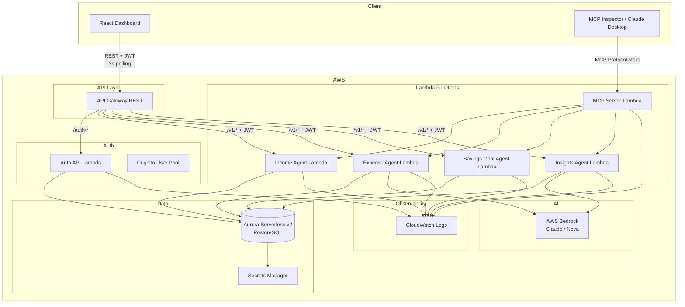
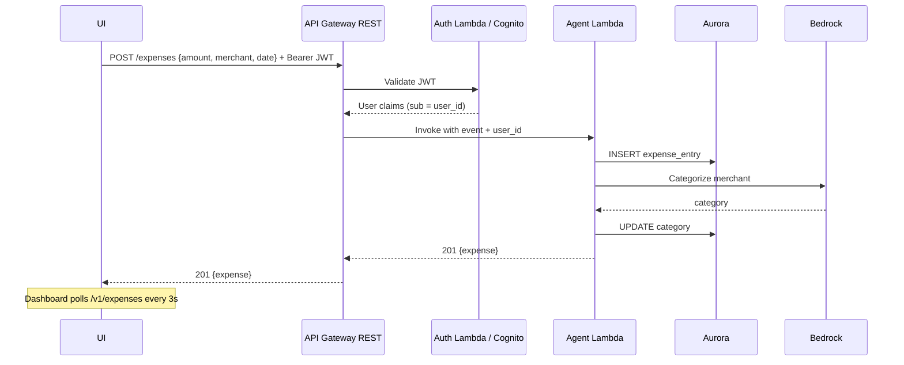

# Design Document: Personal Financial Intelligence Platform MVP

## Overview

The Personal Financial Intelligence Platform (PFIP) is a serverless personal financial intelligence platform built for a 3-day MVP sprint. It exposes four specialized MCP agents (Income, Expense, Savings Goal, Insights) via AWS Lambda, backed by Aurora Serverless v2 PostgreSQL, with AI-powered categorization and natural language insights via AWS Bedrock. A React dashboard polls the REST API every 3 seconds for real-time updates.

The design prioritizes end-to-end demo-ability over production hardening. Every component is deployable via Terraform and wired through GitHub Actions CI/CD.

> **Scope decisions:** WebSocket was dropped in favour of HTTP polling (simpler, sufficient for demo). Auth uses a local JWT service (Auth_API) for development; Cognito is provisioned for production.

### High-Level Architecture



---

## Architecture

### Deployment Model

All compute runs on AWS Lambda (Python 3.11). API Gateway provides one surface:
- **REST API** — CRUD operations for each agent + auth endpoints, protected by JWT authorizer

**Auth strategy:**
- Local dev: `Auth_API` Lambda (bcrypt + python-jose HS256 JWT) — no Cognito needed
- Production: Cognito User Pool provisioned via Terraform; API Gateway uses Cognito JWT authorizer

The MCP Server runs as a separate process via stdio transport (for MCP Inspector / Claude Desktop). In production it can be invoked as a Lambda.

### Request Flow (REST)



### Dashboard Polling Flow

The dashboard uses HTTP polling (every 3 seconds) instead of WebSocket. This was a deliberate scope reduction — sufficient for demo, eliminates WebSocket infrastructure.

```
Dashboard → GET /v1/income    every 3s → update totals
Dashboard → GET /v1/expenses  every 3s → update charts
Dashboard → GET /v1/goals     on Goals tab load
```

---

## Components and Interfaces

### Income Agent Lambda

Handles income entry creation and retrieval.

| Operation | HTTP Method | Path | Description |
|-----------|-------------|------|-------------|
| Create income | POST | `/income` | Persist entry, broadcast WS event |
| List income | GET | `/income` | Return entries sorted by date desc |

**MCP Tool:** `create_income_entry(amount, source, date, notes?)` → `IncomeEntry`
**MCP Tool:** `list_income_entries()` → `IncomeEntry[]`

### Expense Agent Lambda

Handles expense creation with Bedrock categorization.

| Operation | HTTP Method | Path | Description |
|-----------|-------------|------|-------------|
| Create expense | POST | `/expenses` | Persist, categorize via Bedrock, broadcast WS |
| List expenses | GET | `/expenses` | Return entries with categories |

**MCP Tool:** `create_expense_entry(amount, merchant, date)` → `ExpenseEntry`
**MCP Tool:** `list_expense_entries()` → `ExpenseEntry[]`

Bedrock prompt template:
```
Categorize this expense into exactly one of: Groceries, Transportation, Entertainment,
Utilities, Healthcare, Shopping, Dining, Other.
Merchant: {merchant}, Amount: {amount}
Respond with only the category name.
```

### Savings Goal Agent Lambda

Tracks goals and computes progress + predicted completion.

| Operation | HTTP Method | Path | Description |
|-----------|-------------|------|-------------|
| Create goal | POST | `/goals` | Persist goal |
| List goals | GET | `/goals` | Return goals with progress + prediction |

**MCP Tool:** `create_savings_goal(name, target_amount, target_date)` → `SavingsGoal`
**MCP Tool:** `list_savings_goals()` → `SavingsGoalWithProgress[]`

Progress calculation:
- `current_amount = SUM(income since goal creation) - SUM(expenses since goal creation)`
- `monthly_rate = avg daily savings over last 30 days × 30`
- `predicted_date = today + (target_amount - current_amount) / monthly_rate`

### Insights Agent Lambda

Answers natural language queries using Bedrock with financial context.

| Operation | HTTP Method | Path | Description |
|-----------|-------------|------|-------------|
| Query insights | POST | `/v1/insights/query` | NL query → Bedrock → answer |

**MCP Tool:** `query_insights(question)` → `InsightResponse`

Context assembly: fetches last 90 days of income + expenses + all active goals, serializes to JSON, injects into Bedrock prompt.

**Bedrock prompt template (Insights):**
```
You are a personal finance assistant. Answer the user's question based ONLY on the financial data provided below. Do not invent numbers or make assumptions beyond the data.

Financial context (JSON):
{context_json}

User question: {question}

Provide a concise, helpful answer. If the data is insufficient to answer, say so clearly.
```

**Output validation:** Response must be non-empty string. If empty or Bedrock fails, return fallback: `"I was unable to process your query at this time. Please try again."`

### MCP Server Lambda

Exposes all four agents as MCP tools and resources.

**Tool naming convention:** `{verb}_{entity}` — verbs are `create`, `list`, `query`. All tool names are snake_case.

**Tools registry:**

| Tool Name | Agent | Inputs | Output |
|-----------|-------|--------|--------|
| `create_income_entry` | Income | `amount: float, source: str, date: str, notes?: str` | `IncomeEntry` |
| `list_income_entries` | Income | — | `IncomeEntry[]` |
| `create_expense_entry` | Expense | `amount: float, merchant: str, date: str` | `ExpenseEntry` |
| `list_expense_entries` | Expense | — | `ExpenseEntry[]` |
| `create_savings_goal` | Savings | `name: str, target_amount: float, target_date: str` | `SavingsGoal` |
| `list_savings_goals` | Savings | — | `SavingsGoalWithProgress[]` |
| `query_insights` | Insights | `question: str` | `InsightResponse` |

**Example MCP tool call (Claude Desktop → MCP Server):**
```json
{
  "tool": "create_expense_entry",
  "input": {
    "amount": 50,
    "merchant": "Uber",
    "date": "2026-04-22"
  }
}
```

**Example MCP success response:**
```json
{
  "result": {
    "id": "uuid",
    "amount": 50.00,
    "merchant": "Uber",
    "category": "Transportation",
    "date": "2026-04-22",
    "created_at": "2026-04-22T10:30:00Z"
  }
}
```

**Example MCP error response:**
```json
{
  "error": {
    "code": "validation_error",
    "message": "amount must be greater than 0"
  }
}
```

**Resources:**

| URI | Description |
|-----|-------------|
| `income://entries` | All income entries for authenticated user |
| `expenses://entries` | All expense entries with categories |
| `goals://active` | Active savings goals with progress |

### API Contract

All endpoints are versioned under `/v1/`.

| Endpoint | Method | Request Body | Success Response |
|----------|--------|-------------|-----------------|
| `/v1/income` | POST | `{amount, source, date, notes?}` | 201 `IncomeEntry` |
| `/v1/income` | GET | — | 200 `IncomeEntry[]` |
| `/v1/expenses` | POST | `{amount, merchant, date}` | 201 `ExpenseEntry` |
| `/v1/expenses` | GET | — | 200 `ExpenseEntry[]` |
| `/v1/goals` | POST | `{name, target_amount, target_date}` | 201 `SavingsGoal` |
| `/v1/goals` | GET | — | 200 `SavingsGoalWithProgress[]` |
| `/v1/insights/query` | POST | `{question}` | 200 `InsightResponse` |

**Standard error envelope (all endpoints):**
```json
{"error": "validation_error", "detail": "amount must be greater than 0", "status": 400}
```

### Observability

**CloudWatch Metrics (per Lambda):** invocation count, error count, duration p50/p95, throttle count.

**Custom metrics emitted by agents:**
- `bedrock_latency_ms` — emitted by Expense_Agent and Insights_Agent on every Bedrock call
- `categorization_fallback_count` — emitted by Expense_Agent when defaulting to "Other"

**CloudWatch Alarms:**
- Error rate > 5% over 5 minutes → alert
- Insights_Agent p95 latency > 5s → alert

**X-Ray tracing** enabled on all Lambda functions for end-to-end request tracing.

### Savings Goal Logic (MVP Simplification)

> **Known limitation:** Progress is calculated as `SUM(all income since goal creation) - SUM(all expenses since goal creation)`. This is a simplified formula that does not account for multiple overlapping goals or explicit per-goal contributions. This is intentional for the MVP and documented as such in the demo script.


Manages connection lifecycle and event broadcasting.

- `$connect` — validate JWT from query param, store `{connectionId, user_id, connected_at}` in `ws_connections` table
- `$disconnect` — delete connection record
- `broadcast` — invoked by agent Lambdas; queries connections by `user_id`, calls `ApiGatewayManagementApi.post_to_connection`

### Auth API Lambda

Handles local user registration and login (development mode).

| Operation | HTTP Method | Path | Description |
|-----------|-------------|------|-------------|
| Register | POST | `/auth/register` | Create account, return JWT |
| Login | POST | `/auth/login` | Verify credentials, return JWT |
| Me | GET | `/auth/me` | Return current user info |

Password hashing: bcrypt. JWT: HS256, 24-hour expiry, secret from Secrets Manager.

### React Dashboard

Single-page app with 4 tabs:
- **Overview** — income total, expense total, net savings; bar chart (monthly); pie chart (by category); polls every 3s
- **Transactions** — income/expense lists with inline add forms; AI category shown after save
- **Goals** — goal cards with emerald progress bars + predicted completion dates
- **Insights** — chat-style NL query interface with suggestion prompts

Auth: Login page (email + password) → JWT stored in `localStorage` → attached to all API calls via Axios interceptor. Sign out clears localStorage.

---

## API Contract

## Data Models

### Database Schema (Aurora PostgreSQL 15.4)

```sql
-- Users (local auth + FK integrity for Cognito users)
CREATE TABLE users (
    id                UUID PRIMARY KEY DEFAULT gen_random_uuid(),
    email             TEXT NOT NULL UNIQUE,
    hashed_password   TEXT,          -- bcrypt hash; NULL for Cognito-only users
    created_at        TIMESTAMPTZ NOT NULL DEFAULT NOW(),
    updated_at        TIMESTAMPTZ NOT NULL DEFAULT NOW()
);

-- Income entries
CREATE TABLE income_entries (
    id          UUID PRIMARY KEY DEFAULT gen_random_uuid(),
    user_id     UUID NOT NULL REFERENCES users(id) ON DELETE CASCADE,
    amount      NUMERIC(12, 2) NOT NULL CHECK (amount > 0),
    source      TEXT NOT NULL,
    date        DATE NOT NULL,
    notes       TEXT,
    created_at  TIMESTAMPTZ NOT NULL DEFAULT NOW()
);
CREATE INDEX idx_income_user_date ON income_entries(user_id, date DESC);

-- Expense entries
CREATE TABLE expense_entries (
    id          UUID PRIMARY KEY DEFAULT gen_random_uuid(),
    user_id     UUID NOT NULL REFERENCES users(id) ON DELETE CASCADE,
    amount      NUMERIC(12, 2) NOT NULL CHECK (amount > 0),
    merchant    TEXT NOT NULL,
    category    TEXT NOT NULL DEFAULT 'Other',
    date        DATE NOT NULL,
    created_at  TIMESTAMPTZ NOT NULL DEFAULT NOW()
);
CREATE INDEX idx_expense_user_date ON expense_entries(user_id, date DESC);

-- Savings goals
CREATE TABLE savings_goals (
    id              UUID PRIMARY KEY DEFAULT gen_random_uuid(),
    user_id         UUID NOT NULL REFERENCES users(id) ON DELETE CASCADE,
    name            TEXT NOT NULL,
    target_amount   NUMERIC(12, 2) NOT NULL CHECK (target_amount > 0),
    current_amount  NUMERIC(12, 2) NOT NULL DEFAULT 0,
    target_date     DATE NOT NULL,
    created_at      TIMESTAMPTZ NOT NULL DEFAULT NOW()
);
CREATE INDEX idx_goals_user ON savings_goals(user_id);
```

> **Note:** `ws_connections` table was removed — WebSocket dropped from scope.

### API Response Types (Python dataclasses / Pydantic)

```python
class IncomeEntry(BaseModel):
    id: UUID
    user_id: UUID
    amount: Decimal
    source: str
    date: date
    notes: Optional[str]
    created_at: datetime

class ExpenseEntry(BaseModel):
    id: UUID
    user_id: UUID
    amount: Decimal
    merchant: str
    category: str  # one of the 8 predefined categories
    date: date
    created_at: datetime

class SavingsGoal(BaseModel):
    id: UUID
    user_id: UUID
    name: str
    target_amount: Decimal
    current_amount: Decimal
    target_date: date
    created_at: datetime

class SavingsGoalWithProgress(SavingsGoal):
    progress_pct: float
    predicted_completion_date: Optional[date]

class InsightResponse(BaseModel):
    answer: str
    query: str
    generated_at: datetime
```

### Terraform Module Structure

```
infra/
├── main.tf                  # Root module — all resources + API Gateway routes
├── variables.tf             # All configurable values with placeholders
├── outputs.tf               # API URL, Cognito IDs, S3 bucket, CloudFront URL
├── terraform.tfvars.example # Template — copy to terraform.tfvars and fill in
├── modules/
│   ├── aurora/              # Aurora Serverless v2 cluster + Secrets Manager
│   ├── lambda/              # Reusable Lambda module (one per agent)
│   ├── api_gateway/         # REST API + Cognito JWT authorizer
│   ├── cognito/             # User pool + app client (production auth)
│   └── iam/                 # Per-Lambda least-privilege roles
```

### CI/CD Pipeline (GitHub Actions)

```yaml
# .github/workflows/deploy.yml (outline)
on:
  push:
    branches: [main]

jobs:
  test:
    - pytest with coverage (fail if < 80%)
  
  terraform:
    needs: test
    - terraform init / plan / apply
  
  deploy-lambdas:
    needs: terraform
    - zip + aws lambda update-function-code for each agent
  
  integration-tests:
    needs: deploy-lambdas
    - run against staging endpoints
  
  tag-release:
    needs: integration-tests
    - semantic version tag
```


---

## Correctness Properties

*A property is a characteristic or behavior that should hold true across all valid executions of a system — essentially, a formal statement about what the system should do. Properties serve as the bridge between human-readable specifications and machine-verifiable correctness guarantees.*

### Property 1: Amount validation across all agents

*For any* input to Income Agent, Expense Agent, or Savings Goal Agent where the amount field is zero, negative, or non-numeric, the system should reject the request and return HTTP 400 with a non-empty error message.

**Validates: Requirements 1.4, 2.6, 3.6**

---

### Property 2: Income entries always sorted by date descending

*For any* set of income entries belonging to a user, the list endpoint should return them ordered such that for every adjacent pair (a, b) in the result, `a.date >= b.date`.

**Validates: Requirements 1.2**

---

### Property 3: Expense category always from predefined set

*For any* expense entry stored in the system (regardless of Bedrock response or fallback), the `category` field must be one of: `Groceries`, `Transportation`, `Entertainment`, `Utilities`, `Healthcare`, `Shopping`, `Dining`, `Other`.

**Validates: Requirements 2.3, 2.7**

---

### Property 4: Savings goal progress calculation correctness

*For any* savings goal and any set of income and expense entries created after the goal's `created_at`, the `current_amount` should equal `SUM(income entries since creation) - SUM(expense entries since creation)`.

**Validates: Requirements 3.2**

---

### Property 5: Predicted completion date formula

*For any* savings goal with a positive average monthly savings rate, the `predicted_completion_date` should satisfy: `predicted_date = today + ceil((target_amount - current_amount) / monthly_rate_in_days)`. When the monthly rate is zero or negative, `predicted_completion_date` should be `null`.

**Validates: Requirements 3.3**

---

### Property 6: Goals response includes all required fields

*For any* savings goal returned by the list endpoint, the response object must include `current_amount`, `target_amount`, `progress_pct` (a float between 0 and 100), and `predicted_completion_date` (date or null).

**Validates: Requirements 3.4**

---

### Property 7: Insights context includes data relevant to query type

*For any* natural language query submitted to the Insights Agent, the context payload sent to Bedrock must include income totals, expense totals by category, and active savings goals — regardless of query phrasing.

**Validates: Requirements 4.3, 4.4, 4.5**

---

### Property 8: JWT required for all protected endpoints

*For any* request to a protected REST endpoint (income, expenses, goals, insights) that lacks a valid JWT or carries an expired/malformed token, the system should return HTTP 401 and not execute the handler logic.

**Validates: Requirements 6.3, 6.4**

---

### Property 9: Password requirements enforced

*For any* registration attempt where the password is shorter than 8 characters, or missing at least one uppercase letter, one lowercase letter, or one digit, the system should reject the request with an error.

**Validates: Requirements 6.6**

---

### Property 10: MCP responses are valid MCP-compliant JSON

*For any* MCP tool invocation (success or failure), the response must be parseable JSON that conforms to the MCP protocol schema — containing either a `result` field on success or an `error` field on failure.

**Validates: Requirements 7.4, 7.5**

---

### Property 11: MCP tool invocations are logged

*For any* MCP tool invocation, a structured log entry must be written containing `user_id`, `tool_name`, and `timestamp` fields.

**Validates: Requirements 7.7**

---

### Property 12: Structured JSON logging with required fields

*For any* agent operation (income, expense, savings, insights), the emitted log entry must be valid JSON containing at minimum `user_id`, `operation`, `timestamp`, and `status` fields.

**Validates: Requirements 10.1, 10.2, 10.4**

---

### Property 13: Unhandled exceptions return HTTP 500 and log stack trace

*For any* Lambda invocation that raises an unhandled exception, the HTTP response status must be 500, and the CloudWatch log for that invocation must contain the full stack trace string.

**Validates: Requirements 10.5**

---

### Property 14: Exponential backoff on WebSocket reconnect

*For any* sequence of consecutive reconnect attempts by the dashboard client, the delay before attempt `n` must be `min(2^(n-1) seconds, 30 seconds)` — i.e., 1s, 2s, 4s, 8s, 16s, 30s, 30s, ...

**Validates: Requirements 5.6**

---

### Property 15: Date validation — income entries not in the future

*For any* income entry submission where the `date` field is a future date or is not a valid ISO 8601 date string, the system should reject the request with HTTP 400.

**Validates: Requirements 1.5**

---

### Property 16: Savings goal target date must be in the future

*For any* savings goal creation where `target_date` is today or in the past, the system should reject the request with HTTP 400.

**Validates: Requirements 3.7**

---

## Error Handling

### Validation Errors (HTTP 400)

All agents share a common validation layer (Pydantic models). Invalid inputs return:
```json
{"error": "validation_error", "detail": "<field>: <reason>", "status": 400}
```

### Authentication Errors (HTTP 401)

API Gateway Cognito authorizer returns 401 before the Lambda is invoked. No custom handling needed in Lambda code.

### Bedrock Failures

- Expense Agent: catch `botocore.exceptions.ClientError`, log the error, set `category = "Other"`, continue
- Insights Agent: catch `ClientError`, return `{"answer": "I was unable to process your query at this time. Please try again.", "status": 200}`

### WebSocket Stale Connections

When `post_to_connection` raises `GoneException` (connection no longer exists), the WS handler deletes the stale record from `ws_connections` and continues broadcasting to remaining connections.

### Database Errors

All DB operations are wrapped in try/except. On `psycopg2.OperationalError` (connection failure), Lambda returns HTTP 503. On constraint violations, returns HTTP 400 with the constraint name.

### Unhandled Exceptions

A top-level decorator on each Lambda handler catches all unhandled exceptions, logs the full traceback via `logger.exception()`, and returns HTTP 500:
```json
{"error": "internal_server_error", "request_id": "<lambda_request_id>", "status": 500}
```

---

## Testing Strategy

### Dual Testing Approach

Both unit tests and property-based tests are required. They are complementary:
- Unit tests catch concrete bugs in specific scenarios and integration points
- Property tests verify universal correctness across the full input space

### Unit Tests (pytest)

Focus areas:
- Specific examples: valid income/expense/goal creation with known inputs
- Integration points: Bedrock mock responses, WS handler mock, DB mock via `moto` or `pytest-postgresql`
- Edge cases: Bedrock failure fallback, stale WS connection cleanup, zero monthly savings rate
- Error conditions: expired JWT, missing fields, future income date, past goal target date

Minimum 80% coverage enforced in CI.

### Property-Based Tests (Hypothesis)

Use [Hypothesis](https://hypothesis.readthedocs.io/) for Python property-based testing. Configure each test with `@settings(max_examples=100)`.

Each property test must include a comment referencing the design property:
```
# Feature: pfip-mvp, Property N: <property_text>
```

| Property | Test Description | Hypothesis Strategy |
|----------|-----------------|---------------------|
| P1: Amount validation | Generate zero/negative/non-numeric amounts for all agents | `st.one_of(st.just(0), st.floats(max_value=0), st.text())` |
| P2: Income sort order | Generate N income entries with random dates, verify sort | `st.lists(st.dates(), min_size=1)` |
| P3: Category from predefined set | Generate random merchant names, verify category ∈ allowed set | `st.text(min_size=1)` |
| P4: Progress calculation | Generate random income/expense amounts, verify arithmetic | `st.decimals(min_value=0.01, max_value=9999)` |
| P5: Predicted date formula | Generate goal + rate, verify date formula | `st.decimals(min_value=0.01)` |
| P6: Goals response fields | Generate goals, verify all required fields present | `st.builds(SavingsGoal, ...)` |
| P7: Insights context completeness | Generate queries, verify Bedrock payload contains all data types | `st.text(min_size=1)` |
| P8: JWT enforcement | Generate requests without/with invalid tokens, verify 401 | `st.text()` (invalid tokens) |
| P9: Password validation | Generate passwords violating each rule, verify rejection | `st.text(max_size=7)` + custom strategies |
| P10: MCP JSON compliance | Generate tool calls, verify response schema | `st.builds(MCPToolCall, ...)` |
| P11: MCP logging | Generate tool invocations, verify log fields | `st.builds(MCPToolCall, ...)` |
| P12: Structured logging | Generate operations, verify log JSON fields | `st.sampled_from(operations)` |
| P13: HTTP 500 on exception | Inject exceptions, verify status + log | `st.exceptions()` (custom strategy) |
| P14: Exponential backoff | Generate attempt counts, verify delay sequence | `st.integers(min_value=1, max_value=10)` |
| P15: Income date validation | Generate future dates + invalid strings, verify 400 | `st.dates(min_value=tomorrow)` |
| P16: Goal target date validation | Generate past/present dates, verify 400 | `st.dates(max_value=today)` |

### Integration Tests

Run against deployed staging environment in CI after `terraform apply`:
- Full round-trip: create income → verify WS event received → verify dashboard total updated
- Bedrock integration: create expense → verify category assigned (not "Other" for obvious merchants)
- MCP tool discovery: connect Claude Desktop → list tools → verify all 4 agents present
- Auth flow: register → login → call protected endpoint → logout → verify token invalidated

### Demo Seed Script

`scripts/seed_demo.py` — creates one demo user with:
- 3 months of income entries (salary + freelance)
- 2 months of categorized expenses across all 8 categories
- 2 active savings goals (vacation, emergency fund)

Run via: `python scripts/seed_demo.py --env staging`
