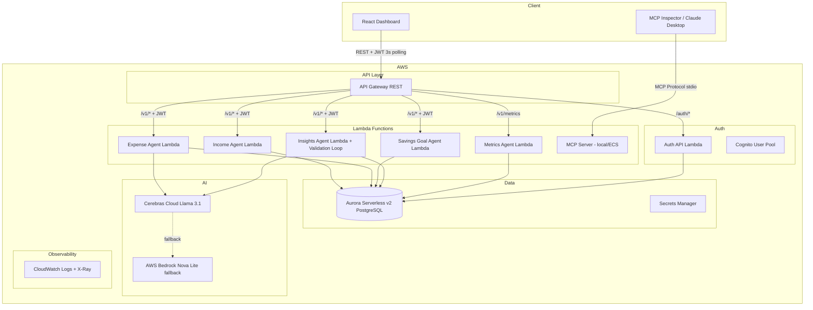

# Design Document: Personal Financial Intelligence Platform MVP

## Overview

PFIP is a serverless personal financial intelligence platform. It exposes five specialized agents (Income, Expense, Savings Goal, Insights, Metrics) via AWS Lambda, backed by Aurora Serverless v2 PostgreSQL, with AI-powered categorization and natural language insights via Cerebras (local) / AWS Bedrock (production). The Insights Agent implements a production-grade AI governance system: typed Pydantic agent contracts, an OrchestrationState object for full execution traceability, a 4-layer deterministic Validation Engine, explicit retry control (MAX_RETRIES=1), and runtime cost/latency guardrails.

> **Scope decisions:** WebSocket dropped in favour of HTTP polling. Auth uses local JWT for development; Cognito provisioned for production. LLM validation loop added to prevent hallucinated numbers; SQL fallback is the last resort, not the first step.

---

## Architecture

### High-Level Diagram



---

## Insights Agent — Production-Grade AI Governance

The Insights Agent is the coordinator of the multi-agent system. It implements a full AI governance pipeline: typed contracts, orchestration state, schema validation, 4-layer validation engine, explicit retry control, and runtime guardrails.

### Orchestration Flow

```
User question
     ↓
[Insights_Agent — Coordinator]
0. Create OrchestrationState(trace_id=uuid4(), user_id, question)
1. Invoke Income_Agent worker    → IncomeAgentContract (Pydantic, fetched_at)
2. Invoke Expense_Agent worker   → ExpenseAgentContract (Pydantic, fetched_at)
3. Invoke Savings_Agent worker   → SavingsAgentContract (Pydantic, fetched_at)
4. Merge contracts → unified context + data_sources list
5. Call LLM → Draft Answer        ← LLM always called first
     ↓
6. LLM Output Schema Validator (pre-gate, deterministic)
   ├── Empty output?              → schema_empty_output → SQL fallback
   ├── JSON-formatted output?     → schema_json_not_prose → SQL fallback
   └── Exceeds MAX_ANSWER_TOKENS? → schema_output_too_long → SQL fallback
     ↓
7. Validation Engine (deterministic, 4 layers)
   ├── Layer 1: Numeric grounding  — numbers match context data (±1.5%)
   ├── Layer 2: Coverage check     — answer references relevant entities
   ├── Layer 3: Relevance check    — not a deflection, has substance
   └── Layer 4: Consistency check  — no self-contradiction
     ↓
8. Decision Engine (explicit, bounded by MAX_RETRIES=1)
   ├── ALL layers pass             → ACCEPT (decision="accept")
   └── Any layer fails             → CoT retry (retries_used < MAX_RETRIES)
         ↓
   Schema validate retry output
         ↓
   Re-run all 4 Validation Engine layers
   ├── Retry passes                → ACCEPT (decision="retry")
   └── Retry fails                 → SQL fallback (decision="fallback")
                                        └── No SQL answer → best-effort draft
     ↓
9. Runtime guardrail check
   ├── elapsed_ms > LATENCY_LIMIT_MS → log warning with trace_id
   └── cost tracked via llm_usage table
     ↓
Final Response → User
{answer, trace_id, decision, reason, retried, data_sources}
```

### Decision Table

| Decision | Reason | Description |
|----------|--------|-------------|
| `accept` | `numbers_verified` | All 4 validation layers passed on first attempt |
| `retry` | `cot_retry_verified` | First attempt failed, CoT retry passed all layers |
| `fallback` | `sql_after_llm_unverified` | Both LLM attempts failed, SQL used |
| `fallback` | `schema_empty_output` | LLM returned empty string |
| `fallback` | `schema_json_not_prose` | LLM returned JSON instead of prose |
| `fallback` | `schema_output_too_long` | LLM output exceeded MAX_ANSWER_TOKENS |
| `accept` | `best_effort_unverified` | No SQL answer, returning draft |

### Guardrail Constants

| Constant | Value | Purpose |
|----------|-------|---------|
| `MAX_RETRIES` | 1 | Hard limit on LLM retries per request |
| `MAX_ANSWER_TOKENS` | 512 | Reject LLM output exceeding this word count |
| `LLM_TIMEOUT_S` | 10.0 | Documented per-call timeout (Lambda-level enforcement) |
| `COST_LIMIT_USD` | 0.01 | Per-request cost guardrail — violations logged |
| `LATENCY_LIMIT_MS` | 8000 | Per-request latency guardrail — violations logged with trace_id |

### OrchestrationState

Tracks the full execution flow of every insights query. Logged on completion.

```python
OrchestrationState:
    trace_id: str              # UUID, unique per request
    user_id: str
    question: str
    started_at: datetime
    data_sources: list[str]    # ["income_agent", "expense_agent", ...]
    income_fetched: bool
    expense_fetched: bool
    savings_fetched: bool
    llm_calls: int             # 1 (draft only) or 2 (draft + retry)
    validation_attempts: list[ValidationResult]
    decision: str              # accept / retry / fallback / sql_local
    reason: str
    retried: bool
    cost_limit_exceeded: bool
    latency_limit_exceeded: bool
    completed_at: datetime
```

### Validation Engine — 4 Layers

| Layer | Type | Description |
|-------|------|-------------|
| Numeric grounding | Deterministic | Every number in answer found in context (±1.5%) |
| Coverage check | Deterministic | Answer references relevant entities (categories, goals) |
| Relevance check | Deterministic | Answer is not a generic deflection; has substance |
| Consistency check | Deterministic | Answer does not contradict itself or the context |

### Agent Contracts (Coordinator–Worker Pattern)

Each worker returns a validated Pydantic model with a `fetched_at` freshness timestamp:

```python
# IncomeAgentContract
agent: "income_agent"
total_income_90_days: float
income_this_month: float
income_last_month: float
entries: list[IncomeEntry]
fetched_at: datetime

# ExpenseAgentContract
agent: "expense_agent"
total_expenses_90_days: float
expenses_this_month: float
expenses_last_month: float
by_category: dict[str, float]
entries: list[ExpenseEntry]
fetched_at: datetime

# SavingsAgentContract
agent: "savings_agent"
goals: list[SavingsGoalEntry]   # includes progress_pct
fetched_at: datetime
```

> **Deployment note:** Worker contracts currently share the same DB connection for efficiency. Contract boundaries are strictly enforced via Pydantic. In a scaled deployment, these become HTTP calls to the respective Lambda endpoints.

### SQL Fallback Coverage

Deterministic answers for:
- "How much did I spend last/this month?"
- "What is my biggest/smallest expense category?"
- "What is my total income/expenses?"
- "What is my net savings/balance?"
- "Am I on track for my goals?"

---

## Components and Interfaces

### Income Agent Lambda
- `POST /v1/income` — create entry, validate amount > 0 and date not in future
- `GET /v1/income` — list entries sorted by date DESC

### Expense Agent Lambda
- `POST /v1/expenses` — create entry, call LLM categorizer, fallback to rules
- `GET /v1/expenses` — list entries with categories

**Categorization prompt:**
```
Categorize this expense into exactly one of: Groceries, Transportation, Entertainment,
Utilities, Healthcare, Shopping, Dining, Other.
Merchant: {merchant}, Amount: {amount}
Respond with only the category name.
```

### Savings Goal Agent Lambda
- `POST /v1/goals` — create goal with optional initial_amount, validate target_date in future
- `GET /v1/goals` — list goals with progress + predicted completion date

**Progress formula:**
- `current_amount = initial_amount + SUM(income since creation) - SUM(expenses since creation)`
- `monthly_rate = net savings over last 30 days`
- `predicted_date = today + ceil((target - current) / daily_rate)`

### Insights Agent Lambda (Coordinator + Validation Loop)
- `POST /v1/insights/query` — full pipeline: OrchestrationState → worker contracts → LLM → Schema Validator → Validation Engine → Decision Loop → response
- Response: `{answer, trace_id, decision, reason, retried, data_sources}`

### Metrics Agent Lambda
- `GET /v1/metrics` — compute quality baselines + LLM usage stats from `llm_usage` table

**Quality metrics:** categorization accuracy (≥85%), data completeness (100%), goal prediction coverage (≥80%), insights data richness (≥90%), overall quality score.

### MCP Server (local process / ECS Fargate)
- 7 tools: `create_income_entry`, `list_income_entries`, `create_expense_entry`, `list_expense_entries`, `create_savings_goal`, `list_savings_goals`, `query_insights`
- 3 resources: `income://entries`, `expenses://entries`, `goals://active`
- Supports multi-step orchestration: Claude can call `create_expense_entry` then `query_insights` in one interaction

### Auth API Lambda
- `POST /auth/register` — bcrypt hash, store in DB, return JWT
- `POST /auth/login` — verify bcrypt, return JWT (HS256, 24h)
- `GET /auth/me` — decode JWT, return user info

---

## Data Models

### Database Schema

```sql
CREATE TABLE users (
    id UUID PRIMARY KEY DEFAULT gen_random_uuid(),
    email TEXT NOT NULL UNIQUE,
    hashed_password TEXT,
    created_at TIMESTAMPTZ NOT NULL DEFAULT NOW(),
    updated_at TIMESTAMPTZ NOT NULL DEFAULT NOW()
);

CREATE TABLE income_entries (
    id UUID PRIMARY KEY DEFAULT gen_random_uuid(),
    user_id UUID NOT NULL REFERENCES users(id) ON DELETE CASCADE,
    amount NUMERIC(12, 2) NOT NULL CHECK (amount > 0),
    source TEXT NOT NULL,
    date DATE NOT NULL,
    notes TEXT,
    created_at TIMESTAMPTZ NOT NULL DEFAULT NOW()
);
CREATE INDEX idx_income_user_date ON income_entries(user_id, date DESC);

CREATE TABLE expense_entries (
    id UUID PRIMARY KEY DEFAULT gen_random_uuid(),
    user_id UUID NOT NULL REFERENCES users(id) ON DELETE CASCADE,
    amount NUMERIC(12, 2) NOT NULL CHECK (amount > 0),
    merchant TEXT NOT NULL,
    category TEXT NOT NULL DEFAULT 'Other',
    date DATE NOT NULL,
    created_at TIMESTAMPTZ NOT NULL DEFAULT NOW()
);
CREATE INDEX idx_expense_user_date ON expense_entries(user_id, date DESC);

CREATE TABLE savings_goals (
    id UUID PRIMARY KEY DEFAULT gen_random_uuid(),
    user_id UUID NOT NULL REFERENCES users(id) ON DELETE CASCADE,
    name TEXT NOT NULL,
    target_amount NUMERIC(12, 2) NOT NULL CHECK (target_amount > 0),
    current_amount NUMERIC(12, 2) NOT NULL DEFAULT 0,
    initial_amount NUMERIC(12, 2) NOT NULL DEFAULT 0,
    target_date DATE NOT NULL,
    created_at TIMESTAMPTZ NOT NULL DEFAULT NOW()
);
CREATE INDEX idx_goals_user ON savings_goals(user_id);

CREATE TABLE llm_usage (
    id UUID PRIMARY KEY DEFAULT gen_random_uuid(),
    user_id UUID REFERENCES users(id) ON DELETE CASCADE,
    agent TEXT NOT NULL,
    model TEXT NOT NULL,
    prompt_tokens INTEGER NOT NULL DEFAULT 0,
    completion_tokens INTEGER NOT NULL DEFAULT 0,
    total_tokens INTEGER NOT NULL DEFAULT 0,
    latency_ms FLOAT NOT NULL DEFAULT 0,
    estimated_cost_usd FLOAT NOT NULL DEFAULT 0,
    created_at TIMESTAMPTZ NOT NULL DEFAULT NOW()
);
CREATE INDEX idx_llm_usage_user ON llm_usage(user_id, created_at DESC);
```

---

## API Contract

| Endpoint | Method | Auth | Request | Response |
|----------|--------|------|---------|----------|
| `/auth/register` | POST | None | `{email, password}` | 201 `{access_token, email}` |
| `/auth/login` | POST | None | `{email, password}` | 200 `{access_token, email}` |
| `/auth/me` | GET | JWT | — | 200 `{user_id, email}` |
| `/v1/income` | POST | JWT | `{amount, source, date, notes?}` | 201 `IncomeEntry` |
| `/v1/income` | GET | JWT | — | 200 `IncomeEntry[]` |
| `/v1/expenses` | POST | JWT | `{amount, merchant, date}` | 201 `ExpenseEntry` |
| `/v1/expenses` | GET | JWT | — | 200 `ExpenseEntry[]` |
| `/v1/goals` | POST | JWT | `{name, target_amount, target_date, initial_amount?}` | 201 `SavingsGoal` |
| `/v1/goals` | GET | JWT | — | 200 `SavingsGoalWithProgress[]` |
| `/v1/insights/query` | POST | JWT | `{question}` | 200 `{answer, trace_id, decision, reason, retried, data_sources}` |
| `/v1/metrics` | GET | JWT | — | 200 `MetricsResponse` |

**Standard error envelope:**
```json
{"error": "validation_error", "detail": "amount must be greater than 0", "status": 400}
```

---

## Terraform Module Structure

```
infra/
├── main.tf
├── variables.tf
├── outputs.tf
├── terraform.tfvars.example
└── modules/
    ├── aurora/       # Aurora Serverless v2 + Secrets Manager
    ├── lambda/       # Reusable Lambda module (Python 3.11, X-Ray, 7-day logs)
    ├── api_gateway/  # REST API + Cognito JWT authorizer
    ├── cognito/      # User pool + app client
    └── iam/          # Per-Lambda least-privilege roles
```

---

## Observability

**CloudWatch Metrics (per Lambda):** invocation count, error count, duration p50/p95, throttle count.

**Custom metrics:**
- `llm_latency_ms` — emitted by Expense_Agent and Insights_Agent
- Validation Engine decisions logged with `trace_id`, `decision`, `reason`, `retried`, `llm_calls`, `data_sources`
- Guardrail violations logged with `trace_id` when LATENCY_LIMIT_MS exceeded

**X-Ray tracing** enabled on all Lambda functions.

**End-to-end traceability:** Every insights request generates a `trace_id` (UUID) propagated through OrchestrationState, all log entries, and the API response.
