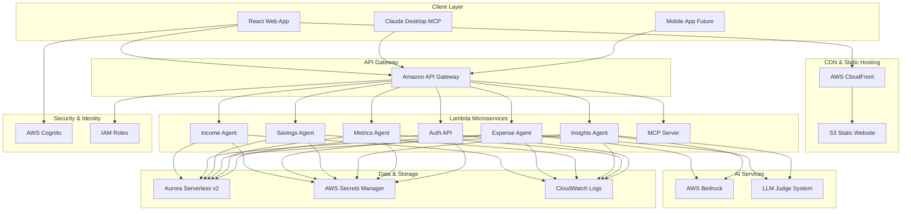

# PFIP Architecture Documentation

## Overview

The Personal Financial Intelligence Platform (PFIP) is built on a modern, serverless architecture that leverages AWS cloud services and AI technologies to provide intelligent personal finance management.

## High-Level Architecture



## Component Architecture

### Frontend Layer

#### React Web Application
- **Framework**: React 18+ with TypeScript
- **Build Tool**: Vite
- **State Management**: React Context + Hooks
- **Charts**: Recharts for data visualization
- **Styling**: CSS with responsive design
- **Deployment**: S3 static hosting with CloudFront CDN

#### Model Context Protocol (MCP) Integration
- **Protocol**: MCP 1.0 specification
- **Server**: Python-based MCP server
- **Tools**: 7 financial management tools
- **Resources**: 3 data resources
- **Integration**: Claude Desktop compatibility

### Backend Microservices

#### Service Architecture Pattern
Each microservice follows the same pattern:
- **Handler**: FastAPI application with Mangum adapter
- **Models**: Pydantic models for data validation
- **Business Logic**: Domain-specific operations
- **Database**: PostgreSQL integration via shared utilities

#### Income Agent
```python
# Handles income tracking and management
- POST /v1/income - Create income entry
- GET /v1/income - List income entries
- Features: Recurring income, categorization, validation
```

#### Expense Agent
```python
# Handles expense tracking with AI categorization
- POST /v1/expenses - Create expense entry
- GET /v1/expenses - List expense entries
- Features: AI categorization, receipt processing, categories
```

#### Savings Agent
```python
# Manages savings goals and progress tracking
- POST /v1/goals - Create savings goal
- GET /v1/goals - List savings goals
- Features: Progress calculation, milestones, projections
```

#### Insights Agent
```python
# Provides AI-powered financial insights
- POST /v1/insights/query - Natural language queries
- Features: LLM integration, judge system, SQL fallback
```

#### Metrics Agent
```python
# Real-time financial metrics and analytics
- GET /v1/metrics - Financial metrics
- Features: Dashboard data, trends, calculations
```

#### MCP Server
```python
# Model Context Protocol server for AI integration
- Tools: Income, expense, goal management
- Resources: Financial summaries, reports
- Features: Claude Desktop integration
```

### Data Layer

#### Aurora Serverless v2
- **Engine**: PostgreSQL 15.4
- **Scaling**: Automatic scaling based on demand
- **High Availability**: Multi-AZ deployment
- **Backup**: Automated backups and point-in-time recovery

#### Database Schema
```sql
-- Core tables
users                    -- User accounts and profiles
income_entries           -- Income tracking data
expense_entries          -- Expense tracking data
savings_goals            -- Savings goals and targets
goal_contributions       -- Goal progress tracking
categories               -- Expense categories
insights_queries         -- AI query history
metrics_cache            -- Cached calculations
```

#### Connection Management
- **Connection Pooling**: Efficient database connections
- **Transaction Management**: ACID compliance
- **Migration System**: Version-controlled schema changes
- **Seeding**: Demo data for development

### AI & Machine Learning

#### AWS Bedrock Integration
```python
# AI services integration
- Claude 3.5 Sonnet for categorization
- Nova models for insights generation
- Custom prompts for financial contexts
- Response validation and filtering
```

#### LLM-as-Judge System
```python
# Quality assurance for AI responses
class ResponseJudge:
    def validate_response(self, query: str, response: str) -> bool:
        # Chain-of-thought validation
        # Accuracy checking
        # SQL fallback mechanism
        # Confidence scoring
```

#### Accuracy Tracking
```python
# Continuous improvement system
class AccuracyTracker:
    def track_prediction(self, predicted: str, actual: str) -> float:
        # Accuracy metrics
        # Model performance tracking
        # Retraining triggers
```

### Security Architecture

#### Authentication & Authorization
```python
# Multi-layer security
- AWS Cognito (production)
- JWT tokens (development)
- Role-based access control
- API key management
```

#### Data Protection
- **Encryption**: Data at rest and in transit
- **Secrets Management**: AWS Secrets Manager
- **Input Validation**: Pydantic models and sanitization
- **SQL Injection Prevention**: Parameterized queries
- **CORS**: Proper cross-origin configuration

#### Compliance & Auditing
- **Audit Logging**: CloudWatch integration
- **Access Logging**: API Gateway logs
- **Error Tracking**: Structured error reporting
- **Performance Monitoring**: Lambda metrics

### Infrastructure as Code

#### Terraform Structure
```
infra/
├── main.tf                 # Main configuration
├── variables.tf            # Input variables
├── outputs.tf              # Output values
├── terraform.tfvars        # Environment variables
├── modules/
│   ├── aurora/            # Database configuration
│   ├── cognito/           # User management
│   ├── lambda/            # Function deployment
│   ├── api-gateway/       # API configuration
│   └── s3/               # Static hosting
```

#### CI/CD Pipeline
```yaml
# GitHub Actions workflow
- Test execution (pytest)
- Code quality checks (flake8, black)
- Security scanning (bandit)
- Infrastructure deployment (terraform)
- Frontend build and deployment
```

## Design Patterns

### Microservices Pattern
- **Single Responsibility**: Each service handles one domain
- **Loose Coupling**: Services communicate via APIs
- **High Cohesion**: Related functionality grouped together
- **Independent Deployment**: Services can be updated independently

### Serverless Pattern
- **Event-Driven**: Lambda functions triggered by API events
- **Auto-Scaling**: Automatic scaling based on demand
- **Pay-per-Use**: Cost-effective consumption model
- **Managed Infrastructure**: Reduced operational overhead

### AI Integration Pattern
- **Fallback Strategy**: SQL fallback when AI fails
- **Validation Layer**: Quality assurance for AI responses
- **Context Management**: Financial context for AI prompts
- **Accuracy Tracking**: Continuous improvement system

## Performance Considerations

### Database Optimization
- **Indexing Strategy**: Proper indexes for query performance
- **Connection Pooling**: Efficient connection management
- **Query Optimization**: Efficient SQL queries
- **Caching Strategy**: Redis for frequently accessed data

### Lambda Performance
- **Cold Start Optimization**: Minimal package size
- **Memory Management**: Efficient memory usage
- **Timeout Handling**: Appropriate timeout values
- **Error Handling**: Graceful error recovery

### Frontend Performance
- **Code Splitting**: Lazy loading of components
- **Image Optimization**: Compressed and optimized images
- **Caching Strategy**: Browser and CDN caching
- **Bundle Optimization**: Minimal JavaScript bundles

## Monitoring & Observability

### Logging Strategy
```python
# Structured logging with correlation
logger.info(
    "Income entry created",
    user_id=str(user_id),
    operation="create_income",
    status="ok",
    entry_id=str(entry.id),
    xray_trace_id=trace_id
)
```

### Metrics Collection
- **Application Metrics**: Custom business metrics
- **Infrastructure Metrics**: Lambda performance
- **Database Metrics**: Query performance
- **User Metrics**: Usage patterns and analytics

### Error Tracking
- **Structured Errors**: Consistent error format
- **Stack Traces**: Detailed error information
- **Error Aggregation**: Grouping similar errors
- **Alerting**: Critical error notifications

## Scalability & Future Growth

### Horizontal Scaling
- **Lambda Scaling**: Automatic function scaling
- **Database Scaling**: Aurora serverless scaling
- **CDN Scaling**: Global content delivery
- **Load Balancing**: API Gateway load distribution

### Vertical Scaling
- **Memory Allocation**: Lambda memory configuration
- **Database Performance**: Aurora instance sizing
- **Compute Resources**: CPU optimization
- **Storage Capacity**: Dynamic storage allocation

### Architecture Evolution
- **Service Mesh**: Future microservice communication
- **Event Sourcing**: Audit trail and replay capability
- **CQRS Pattern**: Read/write separation
- **Multi-Region**: Geographic distribution

## Development Workflow

### Local Development
```bash
# Development environment setup
docker-compose up -d              # Local database
python3 scripts/migrate.py       # Database setup
uvicorn scripts.run_api_local:app --reload  # Backend
cd frontend && npm run dev       # Frontend
```

### Testing Strategy
- **Unit Tests**: Business logic validation
- **Integration Tests**: API endpoint testing
- **E2E Tests**: User journey testing
- **Performance Tests**: Load and stress testing

### Deployment Pipeline
```bash
# Automated deployment
terraform plan                   # Infrastructure validation
terraform apply                  # Infrastructure deployment
bash scripts/package_lambdas.sh  # Lambda packaging
# Automatic frontend deployment
```

---

## Architecture Decisions & Rationale

### Why Serverless?
- **Cost Efficiency**: Pay only for what you use
- **Scalability**: Automatic scaling without management
- **Maintenance**: Reduced operational overhead
- **Focus**: More time on business logic

### Why Aurora Serverless?
- **Performance**: PostgreSQL compatibility
- **Scaling**: Automatic scaling based on demand
- **Reliability**: Multi-AZ high availability
- **Integration**: Native AWS service integration

### Why FastAPI + Lambda?
- **Performance**: Fast async request handling
- **Documentation**: Automatic OpenAPI generation
- **Validation**: Built-in request validation
- **Compatibility**: Mangum adapter for Lambda

### Why Model Context Protocol?
- **Standardization**: Industry protocol for AI integration
- **Interoperability**: Works with multiple AI assistants
- **Extensibility**: Easy to add new tools and resources
- **Future-Proof**: Emerging standard for AI integration

---

*This architecture documentation is continuously updated as the platform evolves.*
