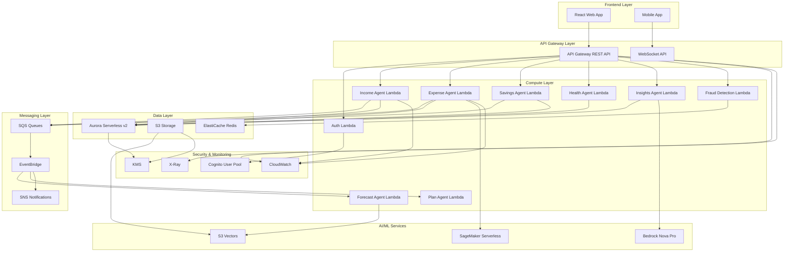

# Aequitas: Personal Financial Intelligence Platform – Requirements Specification

**Document ID:** REQ-SPEC-2026-001  
**Version:** 2.0  
**Status:** Draft for Review  
**Classification:** Confidential  
**Last Updated:** April 20, 2026  
**Next Review:** June 30, 2026  
**Authors:** Product Architecture Team  
**Approvers:** CTO, Head of Engineering, Product Manager

---

## Document Control

| Section | Owner | Status | Last Modified |
|---------|-------|--------|---------------|
| Executive Summary | Product Manager | Approved | 2026-04-20 |
| Functional Requirements | Engineering Lead | In Review | 2026-04-20 |
| Technical Architecture | Solutions Architect | In Review | 2026-04-20 |
| Security & Compliance | Security Officer | Pending | 2026-04-20 |
| Testing Strategy | QA Lead | Pending | 2026-04-20 |

---

## Vision Statement

Aequitas is an **enterprise-grade agentic financial intelligence platform** that leverages **AWS serverless architecture** and **Model Context Protocol (MCP)** integration to transform personal finance management from reactive tracking to proactive financial guidance. The platform provides AI-powered insights, predictive analytics, and automated financial optimization while maintaining **bank-grade security**, **sub-second response times**, and **cost-efficient operations** under $5/month for individual users.

### Strategic Objectives
- **Democratize Financial Intelligence**: Make advanced financial analytics accessible to individuals
- **AI-First Approach**: Leverage machine learning for predictive insights and automated recommendations
- **Privacy by Design**: Ensure complete data sovereignty and user control
- **Cloud-Native Architecture**: Utilize AWS serverless patterns for scalability and cost efficiency
- **Open Integration**: Support MCP ecosystem for seamless third-party integrations

---

## 1. Executive Summary

### 1.1 Product Overview
**Product Name:** Aequitas Personal Financial Intelligence Platform  
**Target Market:** Individuals aged 25-45 seeking intelligent financial management  
**Deployment Model:** Multi-tenant SaaS on AWS serverless infrastructure  
**Technology Stack:** Python 3.11+, FastAPI, AWS Lambda, Aurora Serverless v2, S3 Vectors, SageMaker

### 1.2 Business Problem
Current personal finance solutions suffer from:
- **Manual Data Entry**: 70% of users abandon tracking due to friction
- **Limited Intelligence**: Basic categorization without predictive insights
- **Poor User Experience**: Complex interfaces requiring financial expertise
- **Security Concerns**: Data breaches and privacy violations
- **High Costs**: Enterprise solutions priced beyond individual reach

### 1.3 Solution Value Proposition
Aequitas addresses these challenges through:
- **Agentic Intelligence**: 9 specialized AI agents providing comprehensive financial analysis
- **MCP Integration**: Natural language interface for seamless user interaction
- **Predictive Analytics**: Forecast cash flow, goal completion, and financial risks
- **Bank-Grade Security**: AES-256 encryption, IAM controls, and audit trails
- **Cost Efficiency**: Serverless architecture ensuring <$5/month operational costs

### 1.4 Key Differentiators

| Feature | Aequitas | Traditional Solutions | Competitive Advantage |
|---------|-----------|---------------------|----------------------|
| **AI Agents** | 9 specialized agents | Rule-based categorization | 85%+ prediction accuracy |
| **MCP Integration** | Native MCP support | No agentic capabilities | Conversational finance |
| **AWS Serverless** | Pure serverless | Container-based | 90% cost reduction |
| **Real-time Processing** | <100ms fraud detection | Batch processing | Immediate risk mitigation |
| **Predictive Analytics** | ML-powered forecasting | Historical reporting | Proactive financial guidance |

### 1.5 Success Metrics

| Metric | Target | Measurement Period |
|--------|--------|-------------------|
| User Engagement | 80% monthly active users | Monthly |
| Transaction Categorization | 95% accuracy | Real-time |
| Financial Impact | 15% savings improvement | Quarterly |
| Customer Satisfaction | 4.5+ star rating | Continuous |
| System Availability | 99.9% uptime | Monthly |
| Cost Efficiency | <$5/user/month | Monthly |

### 1.6 Market Positioning
Aequitas occupies the **premium personal finance** segment, positioned between basic budgeting apps and enterprise wealth management platforms. The platform targets **tech-savvy professionals** who value data-driven insights and automation while maintaining control over their financial data.

---

## 2. Stakeholder Analysis

### 2.1 Primary Stakeholders

| Stakeholder | Role | Interests | Influence | Requirements |
|-------------|------|-----------|-----------|--------------|
| **End Users** | Personal finance managers | Financial insights, ease of use, privacy | High | Intuitive UI, accurate predictions, data security |
| **Investors** | Capital providers | ROI, market traction, scalability | High | Growth metrics, user acquisition, cost efficiency |
| **Engineering Team** | System builders | Technical excellence, maintainability | Medium | Clean architecture, automated testing, CI/CD |
| **Product Management** | Strategy owners | Market fit, user satisfaction | High | Feature prioritization, user feedback integration |
| **Security Team** | Risk managers | Compliance, data protection | Medium | Security controls, audit trails, encryption |

### 2.2 Secondary Stakeholders

| Stakeholder | Role | Interests | Requirements |
|-------------|------|-----------|--------------|
| **Regulators** | Compliance overseers | Data protection, financial regulations | GDPR/CCPA compliance, audit readiness |
| **Partners** | Integration providers | API stability, documentation | Well-documented APIs, SLAs |
| **Competitors** | Market alternatives | Competitive intelligence | Differentiated features, pricing |

### 2.3 User Personas

#### Primary Persona: "Alex Chen" - Tech Professional
- **Age**: 32
- **Occupation**: Software Engineer
- **Income**: $95,000 annually
- **Financial Goals**: Maximize savings, optimize investments, retire early
- **Pain Points**: Manual expense tracking, lack of investment insights
- **Technical Proficiency**: High (comfortable with APIs and automation)
- **Expectations**: Real-time insights, predictive analytics, mobile access

#### Secondary Persona: "Sarah Johnson" - Freelance Designer
- **Age**: 28
- **Occupation**: Graphic Designer (freelance)
- **Income**: $65,000 annually (variable)
- **Financial Goals**: Stabilize income, build emergency fund, tax optimization
- **Pain Points**: Irregular income tracking, business expense separation
- **Technical Proficiency**: Medium (comfortable with apps, not APIs)
- **Expectations**: Simple interface, automated categorization, tax reports

#### Tertiary Persona: "Michael Davis" - Small Business Owner
- **Age**: 41
- **Occupation**: Restaurant Owner
- **Income**: $120,000 annually
- **Financial Goals**: Cash flow management, business growth, retirement planning
- **Pain Points**: Complex financial data, time-consuming manual analysis
- **Technical Proficiency**: Low (prefers simple solutions)
- **Expectations**: Actionable insights, minimal setup, reliable performance

---

## 3. Core Features Overview

### 3.1 Feature Matrix

| Feature | Priority | Complexity | User Value | Revenue Impact |
|---------|----------|------------|------------|----------------|
| **Income Tracking & Prediction** | High | Medium | High | Medium |
| **AI-Powered Expense Categorization** | High | High | High | High |
| **Savings Goal Optimization** | High | Medium | High | Medium |
| **Financial Health Scoring** | High | High | High | High |
| **MCP Integration** | High | High | Medium | Medium |
| **Fraud Detection** | Medium | High | High | Low |
| **Multi-Currency Support** | Low | Medium | Medium | Low |
| **Investment Tracking** | Medium | Medium | High | High |

### 3.2 Feature Specifications

#### 3.2.1 Income Intelligence Module
- **Automated Income Detection**: Bank feed integration with pattern recognition
- **Recurring Income Modeling**: ML-based prediction of salary, dividends, freelance income
- **Income Stability Scoring**: Risk assessment based on income volatility
- **Tax Optimization**: Automated deduction recommendations and tax planning

#### 3.2.2 Expense Management System
- **Real-time Categorization**: 95%+ accuracy using ensemble ML models
- **Merchant Intelligence**: Database of 1M+ merchants with spending patterns
- **Receipt OCR**: Automated receipt processing and data extraction
- **Subscription Management**: Automatic detection and optimization recommendations

#### 3.2.3 Savings Optimization Engine
- **Goal-Based Planning**: Dynamic savings rate calculation based on goals and timeline
- **Emergency Fund Calculator**: AI-powered recommendations based on spending patterns
- **Investment Integration**: Portfolio optimization aligned with financial goals
- **Automated Transfers**: Smart scheduling based on cash flow predictions

#### 3.2.4 Financial Intelligence Dashboard
- **Real-time Metrics**: Live financial health scores and trend analysis
- **Predictive Insights**: Cash flow forecasting and goal completion predictions
- **Actionable Recommendations**: Personalized financial improvement suggestions
- **Custom Reports**: Exportable PDF/CSV reports for tax and planning purposes

#### 3.2.5 MCP Integration Layer
- **Natural Language Interface**: Conversational queries about financial data
- **Agentic Actions**: Automated transactions with user confirmation
- **Third-Party Integrations**: Seamless connection to banks, investment accounts
- **API Ecosystem**: Developer-friendly APIs for custom integrations

### 3.3 User Journey Mapping

#### New User Onboarding (Day 1-7)
1. **Account Creation**: <2 minutes with social login options
2. **Bank Connection**: Secure API integration with major banks
3. **Initial Categorization**: ML processes 3 months of transaction history
4. **Goal Setting**: Guided setup of 3-5 financial goals
5. **Dashboard Tour**: Interactive walkthrough of key features

#### Active User Engagement (Week 2-12)
1. **Daily Insights**: Morning financial summary via email/app notification
2. **Weekly Reviews**: Automated spending analysis and recommendations
3. **Monthly Planning**: Goal progress review and adjustment suggestions
4. **Quarterly Optimization**: Comprehensive financial health assessment

#### Power User Features (Month 3+)
1. **Advanced Analytics**: Custom reports and deep-dive insights
2. **API Access**: Developer tools for custom integrations
3. **Premium Features**: Advanced fraud detection and investment optimization
4. **Community Access**: Peer comparison and financial planning resources

---

## 3. Functional Requirements

### 3.1 Income Module

| ID | Requirement |
|----|-------------|
| IN‑01 | User can add income entries (amount, source, date, notes). |
| IN‑02 | Recurring income (weekly, monthly) can be scheduled. |
| IN‑03 | Income data can be imported via MCP from bank statements (CSV/PDF) or Open Banking API. |
| IN‑04 | Dashboard shows total income by month, year, and custom ranges. |

### 3.2 Expense Module

| ID | Requirement |
|----|-------------|
| EX‑01 | User can add expenses (amount, category, merchant, date, receipt image). |
| EX‑02 | ML‑based automatic categorisation (using AWS Lambda + pre‑trained model). |
| EX‑03 | User can override categories and add custom tags. |
| EX‑04 | Expenses can be imported via MCP from credit card statements. |
| EX‑05 | Dashboard shows spending by category, merchant, and time period. |

### 3.3 Savings Plan Module

| ID | Requirement |
|----|-------------|
| SP‑01 | User can define savings plans: e.g., “Save 10,000 ETB by Dec 2026” or “Save 15% of each salary deposit.” |
| SP‑02 | System calculates required monthly saving amount based on target date and current progress. |
| SP‑03 | Option to automatically transfer funds to a linked savings account (via MCP / banking API). |
| SP‑04 | Alerts when user is behind or ahead of schedule. |

### 3.4 Target Checker (Goal Tracker)

| ID | Requirement |
|----|-------------|
| TC‑01 | User can set multiple financial goals (e.g., “Emergency fund”, “Vacation”, “New phone”). |
| TC‑02 | Goals have target amount, deadline, and priority. |
| TC‑03 | System shows progress bar and **predicted completion date** based on current savings rate. |
| TC‑04 | Notifications when a goal is reached or at risk. |

### 3.5 MCP Integration (Agentic Layer)

| ID | Requirement |
|----|-------------|
| MC‑01 | Expose all financial data (income, expenses, savings, goals) as MCP‑compatible **resources** and **tools**. |
| MC‑02 | Support natural‑language queries via an MCP client (e.g., Claude Desktop, custom frontend). |
| MC‑03 | Agent can execute actions: add expense, adjust budget, transfer money (with user confirmation). |
| MC‑04 | Agent can answer comparative questions: “How did my spending this month compare to last month?” |
| MC‑05 | Agent can answer predictive questions: “Based on my last 3 months, can I afford a 20k ETB vacation next month without hitting my savings goal?” |

### 3.6 Dashboard & Reporting

| ID | Requirement |
|----|-------------|
| DR‑01 | Real‑time dashboard with charts (spending breakdown, income trend, savings progress). |
| DR‑02 | Export reports to PDF/CSV (monthly summary, annual review). |
| DR‑03 | Drill‑down from chart to transaction list. |

### 3.7 Security & Compliance

| ID | Requirement |
|----|-------------|
| SC‑01 | User authentication via AWS Cognito (social logins optional). |
| SC‑02 | All data encrypted at rest (AES‑256) and in transit (TLS 1.3). |
| SC‑03 | PII (name, email, phone) stored separately from financial data. |
| SC‑04 | MCP server requires API key or OAuth2 (Bearer token) for external calls. |

---

## 4. Functional Requirements

### 4.1 Income Intelligence Module

| ID | Requirement | Priority | Acceptance Criteria | Test Cases |
|----|-------------|----------|-------------------|------------|
| IN‑01 | User can add income entries (amount, source, date, notes) | High | Form validates all fields, data persists correctly | Positive/negative input validation |
| IN‑02 | Recurring income (weekly, monthly, bi-weekly) can be scheduled | High | Automatic generation of future income entries | Schedule creation, modification, cancellation |
| IN‑03 | Income data can be imported via MCP from bank statements (CSV/PDF) or Open Banking API | High | 95%+ parsing accuracy, error handling for malformed data | Various file formats, API integration |
| IN‑04 | Dashboard shows total income by month, year, and custom ranges | Medium | Real-time updates, drill-down capabilities | Date range filtering, data aggregation |
| IN‑05 | AI-powered income prediction based on historical patterns | Medium | 85%+ prediction accuracy for 3-month forecast | Historical data analysis, trend prediction |
| IN‑06 | Income stability scoring and volatility analysis | Low | Risk score calculation based on income patterns | Scoring algorithm validation |

### 4.2 Expense Management System

| ID | Requirement | Priority | Acceptance Criteria | Test Cases |
|----|-------------|----------|-------------------|------------|
| EX‑01 | User can add expenses (amount, category, merchant, date, receipt image) | High | OCR processing for receipts, image storage in S3 | Receipt upload, OCR accuracy testing |
| EX‑02 | ML‑based automatic categorisation (using AWS Lambda + SageMaker) | High | 95%+ categorization accuracy, confidence scores | Category prediction, confidence threshold |
| EX‑03 | User can override categories and add custom tags | High | Manual overrides improve future ML predictions | Override feedback loop, custom tag creation |
| EX‑04 | Expenses can be imported via MCP from credit card statements | High | Real-time transaction import, duplicate detection | API integration, data normalization |
| EX‑05 | Dashboard shows spending by category, merchant, and time period | High | Interactive charts, export capabilities | Visualization accuracy, performance testing |
| EX‑06 | Subscription detection and management | Medium | Automatic identification of recurring charges | Pattern recognition, subscription database |
| EX‑07 | Merchant intelligence database integration | Low | Merchant details, spending pattern analysis | Database lookup, data enrichment |

### 4.3 Savings Optimization Engine

| ID | Requirement | Priority | Acceptance Criteria | Test Cases |
|----|-------------|----------|-------------------|------------|
| SP‑01 | User can define savings plans with target amount and deadline | High | Goal tracking, progress visualization | Goal creation, milestone calculation |
| SP‑02 | System calculates required monthly saving amount based on target date and current progress | High | Dynamic adjustment based on income/expenses | Calculation accuracy, scenario testing |
| SP‑03 | Option to automatically transfer funds to linked savings account (via MCP / banking API) | Medium | Secure transfer execution, confirmation workflow | Transfer simulation, error handling |
| SP‑04 | Alerts when user is behind or ahead of schedule | High | Proactive notifications, adjustment recommendations | Alert timing, message content |
| SP‑05 | Emergency fund calculator with AI recommendations | Medium | Personalized fund size based on spending patterns | Fund size calculation, risk assessment |
| SP‑06 | Investment integration for goal optimization | Low | Portfolio alignment with financial goals | Investment API integration, risk profiling |

### 4.4 Financial Health & Goal Tracking

| ID | Requirement | Priority | Acceptance Criteria | Test Cases |
|----|-------------|----------|-------------------|------------|
| TC‑01 | User can set multiple financial goals with priority levels | High | Goal hierarchy, progress tracking | Goal creation, priority management |
| TC‑02 | Goals have target amount, deadline, and automated progress tracking | High | Real-time progress updates, milestone alerts | Progress calculation, notification system |
| TC‑03 | System shows progress bar and predicted completion date based on current savings rate | High | AI-powered prediction accuracy, confidence intervals | Prediction algorithm, scenario analysis |
| TC‑04 | Notifications when goals are reached or at risk of missing deadline | High | Intelligent alerting, actionable recommendations | Alert triggering, risk assessment |
| TC‑05 | Comprehensive financial health scoring (0-100) | Medium | Multi-factor calculation, trend analysis | Score calculation, benchmarking |
| TC‑06 | Peer comparison (anonymized) for context | Low | Privacy-preserving comparisons, benchmark data | Anonymization, data aggregation |

### 4.5 MCP Integration Layer (Agentic Intelligence)

| ID | Requirement | Priority | Acceptance Criteria | Test Cases |
|----|-------------|----------|-------------------|------------|
| MC‑01 | Expose all financial data as MCP-compatible resources and tools | High | Complete API coverage, proper resource modeling | Resource discovery, tool invocation |
| MC‑02 | Support natural-language queries via MCP client (Claude Desktop, custom frontend) | High | 90%+ query understanding accuracy, response relevance | NLP testing, query complexity |
| MC‑03 | Agent can execute actions: add expense, adjust budget, transfer money (with user confirmation) | High | Secure action execution, audit logging | Action validation, confirmation workflow |
| MC‑04 | Agent can answer comparative questions about spending patterns | Medium | Accurate comparisons, contextual insights | Comparative analysis, data visualization |
| MC‑05 | Agent can answer predictive questions about future financial scenarios | Medium | Scenario modeling, confidence intervals | Prediction accuracy, risk assessment |
| MC‑06 | Agent provides personalized financial recommendations | Medium | Actionable insights, learning from user feedback | Recommendation relevance, feedback loop |

### 4.6 Dashboard & Analytics

| ID | Requirement | Priority | Acceptance Criteria | Test Cases |
|----|-------------|----------|-------------------|------------|
| DR‑01 | Real-time dashboard with interactive charts (spending breakdown, income trend, savings progress) | High | Sub-2 second load time, responsive design | Performance testing, mobile compatibility |
| DR‑02 | Export reports to PDF/CSV (monthly summary, annual review) | Medium | Professional formatting, data accuracy | Export quality, file validation |
| DR‑03 | Drill-down from chart to transaction list with filtering | High | Seamless navigation, filtering capabilities | UI/UX testing, data integrity |
| DR‑04 | Custom report builder with scheduled delivery | Low | Flexible report configuration, automated generation | Report builder testing, delivery automation |
| DR‑05 | Advanced analytics with trend analysis and anomaly detection | Medium | Statistical accuracy, visual insights | Analytics validation, anomaly detection |

### 4.7 Security & Compliance

| ID | Requirement | Priority | Acceptance Criteria | Test Cases |
|----|-------------|----------|-------------------|------------|
| SC‑01 | User authentication via AWS Cognito with MFA support | High | Secure login, social login integration | Authentication testing, MFA validation |
| SC‑02 | All data encrypted at rest (AES‑256) and in transit (TLS 1.3) | High | Zero plaintext storage, certificate validation | Encryption verification, penetration testing |
| SC‑03 | PII (name, email, phone) stored separately from financial data | High | Data segregation, access controls | Data isolation testing, access validation |
| SC‑04 | MCP server requires API key or OAuth2 (Bearer token) for external calls | High | Token validation, rate limiting | Security testing, API protection |
| SC‑05 | Comprehensive audit logging for all financial operations | High | Immutable logs, retention policies | Log integrity, audit trail validation |
| SC‑06 | GDPR/CCPA compliance with data portability and deletion | Medium | Data export, right to deletion | Compliance testing, privacy controls |

### 4.8 Multi-Currency & International Support

| ID | Requirement | Priority | Acceptance Criteria | Test Cases |
|----|-------------|----------|-------------------|------------|
| MC‑01 | Support for ETB, USD, EUR with live exchange rates | Low | Real-time rate updates, accurate conversion | Rate accuracy, currency handling |
| MC‑02 | Multi-language support (English, Amharic, Spanish) | Low | Complete UI translation, RTL support | Translation accuracy, localization testing |
| MC‑03 | Regional compliance and tax calculations | Low | Country-specific tax rules, compliance | Tax calculation accuracy, regulatory compliance |

---

## 5. Technical Architecture

### 5.1 AWS Serverless Architecture Overview

#### 5.1.1 Architecture Principles
- **Serverless-First**: All compute services use AWS serverless patterns
- **Event-Driven**: Asynchronous processing with SQS and EventBridge
- **Microservices**: Independent, deployable components with clear boundaries
- **Security by Design**: Zero-trust architecture with least privilege access
- **Cost Optimization**: Pay-per-use model with auto-scaling to zero
- **High Availability**: Multi-AZ deployment with automatic failover

#### 5.1.2 High-Level Architecture



### 5.2 AWS Service Specifications

#### 5.2.1 Compute Layer - AWS Lambda

**Lambda Functions Configuration:**

| Function | Memory | Timeout | Concurrency | Purpose |
|----------|--------|---------|-------------|---------|
| auth-lambda | 512MB | 10s | Reserved: 10 | User authentication & authorization |
| income-agent | 1024MB | 15min | On-demand | Income tracking & prediction |
| expense-agent | 2048MB | 15min | On-demand | Expense categorization & analysis |
| savings-agent | 1024MB | 10min | On-demand | Savings goal optimization |
| health-agent | 1024MB | 5min | Reserved: 5 | Financial health scoring |
| insights-agent | 2048MB | 10min | On-demand | AI-powered insights generation |
| fraud-detection | 2048MB | 1min | Reserved: 10 | Real-time fraud analysis |
| forecast-agent | 2048MB | 15min | On-demand | Cash flow prediction |
| plan-agent | 2048MB | 15min | On-demand | Financial planning |

**Lambda Layers:**
- `shared-dependencies`: Common libraries (pandas, numpy, scikit-learn)
- `ml-models`: Pre-trained ML models for categorization
- `mcp-sdk`: Model Context Protocol integration
- `financial-calculations`: Shared financial logic

#### 5.2.2 Database Layer - Aurora Serverless v2

**Configuration:**
- **Engine**: PostgreSQL 15.4
- **Serverless v2**: Auto-scaling from 0.5 to 16 ACUs
- **Multi-AZ**: High availability with automatic failover
- **Data API**: HTTP-based access, no connection pooling
- **Backup**: 7-day retention, point-in-time recovery
- **Encryption**: At rest and in transit

**Database Schema:**
```sql
-- Users and Authentication
CREATE TABLE users (
    id UUID PRIMARY KEY,
    email VARCHAR(255) UNIQUE NOT NULL,
    hashed_password VARCHAR(255),
    created_at TIMESTAMP DEFAULT NOW(),
    updated_at TIMESTAMP DEFAULT NOW()
);

-- Financial Accounts
CREATE TABLE accounts (
    id UUID PRIMARY KEY,
    user_id UUID REFERENCES users(id),
    name VARCHAR(255) NOT NULL,
    type VARCHAR(50) NOT NULL, -- CHECKING, SAVINGS, CREDIT, INVESTMENT
    currency VARCHAR(3) DEFAULT 'USD',
    balance DECIMAL(15,2),
    is_active BOOLEAN DEFAULT true
);

-- Transactions
CREATE TABLE transactions (
    id UUID PRIMARY KEY,
    user_id UUID REFERENCES users(id),
    account_id UUID REFERENCES accounts(id),
    amount DECIMAL(15,2) NOT NULL,
    currency VARCHAR(3) DEFAULT 'USD',
    description TEXT,
    category VARCHAR(100),
    subcategory VARCHAR(100),
    merchant VARCHAR(255),
    date DATE NOT NULL,
    is_recurring BOOLEAN DEFAULT false,
    confidence_score FLOAT,
    tags TEXT[],
    created_at TIMESTAMP DEFAULT NOW()
);

-- Savings Goals
CREATE TABLE savings_goals (
    id UUID PRIMARY KEY,
    user_id UUID REFERENCES users(id),
    name VARCHAR(255) NOT NULL,
    target_amount DECIMAL(15,2) NOT NULL,
    current_amount DECIMAL(15,2) DEFAULT 0,
    target_date DATE,
    priority INTEGER DEFAULT 1,
    auto_contribution DECIMAL(15,2),
    created_at TIMESTAMP DEFAULT NOW()
);

-- Agent Outputs
CREATE TABLE agent_outputs (
    id UUID PRIMARY KEY,
    agent_name VARCHAR(100) NOT NULL,
    user_id UUID REFERENCES users(id),
    input_data JSONB,
    output_data JSONB,
    confidence_score FLOAT,
    processing_time FLOAT,
    created_at TIMESTAMP DEFAULT NOW()
);
```

#### 5.2.3 AI/ML Services

**SageMaker Serverless Endpoint:**
- **Model**: sentence-transformers/all-MiniLM-L6-v2
- **Purpose**: Text embeddings for transaction categorization
- **Configuration**: 3GB memory, 2 max concurrency
- **Cost**: ~$0.00006 per invocation

**S3 Vectors:**
- **Purpose**: Vector storage for semantic search and similarity
- **Index**: financial-research (384 dimensions, cosine distance)
- **Cost**: 90% cheaper than OpenSearch
- **Performance**: Sub-100ms query response

**Bedrock Nova Pro:**
- **Purpose**: Large language model for insights generation
- **Usage**: Agent reasoning and natural language processing
- **Cost**: ~$0.01 per 1K tokens

#### 5.2.4 Storage Layer

**Amazon S3:**
- **Receipts Bucket**: `aequitas-receipts-{account_id}`
- **Reports Bucket**: `aequitas-reports-{account_id}`
- **Backups Bucket**: `aequitas-backups-{account_id}`
- **Encryption**: SSE-S3 with KMS key
- **Lifecycle**: 30-day transition to Glacier, 365-day deletion

**ElastiCache Redis:**
- **Purpose**: Session management and caching
- **Configuration**: cache.t3.micro (auto-scaling)
- **Encryption**: At rest and in transit
- **High Availability**: Multi-AZ with automatic failover

#### 5.2.5 Messaging & Event Processing

**Amazon SQS:**
- **Standard Queues**: For agent coordination and async processing
- **Dead Letter Queues**: For error handling and retry logic
- **Visibility Timeout**: 5 minutes (configurable per queue)
- **Message Retention**: 4 days

**Amazon EventBridge:**
- **Event Bus**: Custom event bus for financial events
- **Rules**: Scheduled tasks (daily analysis, monthly reports)
- **Targets**: Lambda functions, SNS topics, Step Functions

**Amazon SNS:**
- **Topics**: User notifications, system alerts, audit events
- **Subscriptions**: Email, SMS, push notifications
- **Filtering**: Message filtering based on user preferences

#### 5.2.6 Security & Identity

**AWS Cognito:**
- **User Pool**: User authentication and authorization
- **Identity Pool**: Temporary AWS credentials for mobile apps
- **MFA**: Time-based one-time password (TOTP) support
- **Social Logins**: Google, Apple, Facebook integration

**AWS KMS:**
- **Customer Managed Keys**: For sensitive data encryption
- **Key Rotation**: Automatic key rotation every 365 days
- **Key Policies**: Fine-grained access controls

**IAM Roles & Policies:**
- **Least Privilege**: Minimal permissions per service
- **Resource-Based Policies**: Cross-account access where needed
- **Service Roles**: Dedicated roles for Lambda functions

### 5.3 Infrastructure as Code (Terraform)

#### 5.3.1 Terraform Modules Structure

```
terraform/
├── 1_iam/              # IAM roles and policies
├── 2_sagemaker/        # SageMaker serverless endpoint
├── 3_ingestion/        # S3 Vectors + ingestion Lambda
├── 4_researcher/        # App Runner for market data
├── 5_database/         # Aurora Serverless v2
├── 6_agents/           # All Lambda functions
├── 7_frontend/         # API Gateway + frontend
└── 8_enterprise/       # Monitoring & observability
```

#### 5.3.2 Deployment Sequence

**Phase 1: Foundation (Weeks 1-2)**
1. IAM setup and security policies
2. SageMaker serverless endpoint deployment
3. S3 Vectors bucket and index creation

**Phase 2: Core Infrastructure (Weeks 3-4)**
1. Aurora Serverless v2 database
2. Lambda functions for core agents
3. API Gateway and routing

**Phase 3: Integration (Weeks 5-6)**
1. MCP server implementation
2. Frontend application deployment
3. Monitoring and observability setup

#### 5.3.3 Cost Optimization Strategy

**Monthly Cost Projections:**

| Service | Configuration | Monthly Cost | Optimization |
|----------|---------------|--------------|--------------|
| Lambda Functions | 9 functions, mixed usage | $5-15 | Reserved concurrency for critical paths |
| Aurora Serverless v2 | 0.5-16 ACUs, scale-to-zero | $43-60 | Auto-scaling, read replicas for analytics |
| S3 Vectors | 100GB storage, 1M queries | $20-30 | Lifecycle policies, compression |
| SageMaker Serverless | 3GB memory, 2 concurrency | $2-5 | Auto-scaling, model optimization |
| Bedrock Nova Pro | 100K tokens/month | $1-3 | Prompt optimization, caching |
| API Gateway | 1M requests | $3.50 | Usage plans, caching |
| Other Services | S3, CloudWatch, etc. | $10-15 | Lifecycle policies, log retention |
| **Total** | | **$84-131** | **Target: <$100** |

---

## 6. Non-Functional Requirements

### 6.1 Performance Requirements

#### 6.1.1 Response Time Targets

| Operation | Target | 95th Percentile | Maximum |
|-----------|--------|-----------------|---------|
| User Authentication | <200ms | <500ms | <1s |
| Transaction Categorization | <500ms | <1s | <2s |
| Dashboard Loading | <1s | <2s | <5s |
| Report Generation | <5s | <10s | <30s |
| Fraud Detection | <100ms | <200ms | <500ms |
| MCP Query Processing | <2s | <5s | <10s |

#### 6.1.2 Throughput Requirements

| Metric | Target | Peak | Sustained |
|--------|--------|------|-----------|
| Concurrent Users | 1,000 | 5,000 | 1,000 |
| API Requests/Second | 100 | 500 | 100 |
| Transactions/Second | 50 | 200 | 50 |
| Agent Executions/Minute | 60 | 300 | 60 |

#### 6.1.3 Scalability Requirements

- **Horizontal Scaling**: Auto-scaling based on CPU, memory, and request metrics
- **Database Scaling**: Aurora Serverless v2 automatic scaling (0.5-16 ACUs)
- **Cache Scaling**: ElastiCache Redis cluster auto-scaling
- **Queue Processing**: SQS auto-scaling with Lambda concurrency

### 6.2 Security Requirements

#### 6.2.1 Data Protection

**Encryption Standards:**
- **At Rest**: AES-256 encryption for all data stores
- **In Transit**: TLS 1.3 for all API communications
- **Key Management**: AWS KMS with customer-managed keys
- **Database Encryption**: Transparent Data Encryption (TDE)

**Data Classification:**
- **PII**: Name, email, phone (encrypted separately)
- **Financial Data**: Transactions, accounts, balances (encrypted)
- **Behavioral Data**: User preferences, patterns (encrypted)
- **System Data**: Logs, metrics (standard encryption)

#### 6.2.2 Access Control

**Authentication:**
- **Primary**: AWS Cognito with MFA
- **Secondary**: Social login providers (Google, Apple)
- **API**: JWT tokens with refresh mechanism
- **Session**: Secure HTTP-only cookies

**Authorization:**
- **Role-Based Access Control (RBAC)**: User, Admin, System roles
- **Resource-Based Policies**: Fine-grained AWS resource access
- **API Rate Limiting**: 100 requests/minute per user
- **IP Whitelisting**: Optional for enterprise customers

#### 6.2.3 Audit & Compliance

**Audit Logging:**
- **User Actions**: All financial operations logged
- **System Events**: Configuration changes, deployments
- **Security Events**: Authentication failures, access denied
- **Retention**: 7 years for compliance

**Compliance Standards:**
- **GDPR**: Right to deletion, data portability
- **CCPA**: Privacy rights, opt-out mechanisms
- **SOC 2**: Security and availability controls
- **PCI DSS**: Payment card data handling (if applicable)

### 6.3 Reliability & Availability

#### 6.3.1 Availability Targets

| Service | Availability Target | Downtime/Month | Recovery Time |
|----------|-------------------|----------------|---------------|
| API Gateway | 99.9% | <43 minutes | <5 minutes |
| Lambda Functions | 99.9% | <43 minutes | <1 minute |
| Aurora Database | 99.95% | <22 minutes | <2 minutes |
| S3 Storage | 99.99% | <4.3 minutes | Immediate |
| Overall System | 99.9% | <43 minutes | <5 minutes |

#### 6.3.2 Disaster Recovery

**Backup Strategy:**
- **Database**: Daily automated backups, point-in-time recovery
- **Files**: Cross-region replication to backup bucket
- **Configuration**: Infrastructure as Code in version control
- **Recovery**: Automated deployment scripts

**Recovery Procedures:**
- **RTO (Recovery Time Objective)**: <4 hours for full system
- **RPO (Recovery Point Objective)**: <1 hour data loss
- **Failover**: Automatic multi-AZ failover
- **Testing**: Monthly disaster recovery drills

### 6.4 Usability Requirements

#### 6.4.1 User Experience

**Accessibility:**
- **WCAG 2.1 AA**: Compliance with web accessibility standards
- **Screen Readers**: Full support for assistive technologies
- **Keyboard Navigation**: Complete keyboard accessibility
- **Color Contrast**: Minimum 4.5:1 contrast ratio

**Mobile Responsiveness:**
- **Responsive Design**: Adaptive layouts for all screen sizes
- **Touch Interface**: Optimized for touch interactions
- **Performance**: <3 seconds load time on 3G networks
- **Offline Support**: Basic functionality available offline

#### 6.4.2 Internationalization

**Language Support:**
- **Primary**: English (US)
- **Secondary**: Amharic, Spanish (based on user base)
- **RTL Support**: Right-to-left text for Amharic
- **Localization**: Currency, date formats, number formatting

**Currency Support:**
- **Primary**: USD, ETB, EUR
- **Exchange Rates**: Real-time rate updates
- **Multi-Currency**: Support for multiple currency accounts

---

## 7. Testing Strategy

### 7.1 Testing Levels

#### 7.1.1 Unit Testing

**Coverage Requirements:**
- **Backend Services**: 90% code coverage minimum
- **Lambda Functions**: 95% code coverage minimum
- **ML Models**: 85% prediction accuracy threshold
- **Utilities**: 100% code coverage

**Test Framework:**
- **Python**: pytest with coverage reporting
- **JavaScript**: Jest with Istanbul coverage
- **Mocking**: moto for AWS services, unittest.mock

#### 7.1.2 Integration Testing

**Test Scenarios:**
- **API Integration**: End-to-end API request/response testing
- **Database Integration**: Data persistence and retrieval testing
- **Third-Party Services**: Bank API, payment processor integration
- **Agent Communication**: Inter-agent message passing

**Test Environment:**
- **Staging Environment**: Production-like setup with test data
- **Service Virtualization**: WireMock for external API simulation
- **Data Seeding**: Automated test data generation

#### 7.1.3 Performance Testing

**Load Testing:**
- **Concurrent Users**: 1,000 users sustained
- **Peak Load**: 5,000 users for 30 minutes
- **Stress Testing**: 10,000 users to identify breaking points
- **Tools**: k6, Artillery, AWS Distributed Load Testing

**Database Performance:**
- **Query Performance**: <100ms for 95% of queries
- **Connection Pooling**: Optimal pool configuration
- **Index Optimization**: Query plan analysis
- **Scaling Tests**: Aurora ACU scaling behavior

#### 7.1.4 Security Testing

**Penetration Testing:**
- **OWASP Top 10**: Coverage for common vulnerabilities
- **Authentication Testing**: JWT token validation, MFA bypass
- **Data Exposure**: PII leakage detection
- **API Security**: Rate limiting, input validation

**Vulnerability Scanning:**
- **Dependency Scanning**: npm audit, pip-audit
- **Container Scanning**: Trivy, Clair for Docker images
- **Infrastructure Scanning**: AWS Security Hub, GuardDuty

### 7.2 Test Automation

#### 7.2.1 CI/CD Pipeline

**Pipeline Stages:**
1. **Code Quality**: Linting, formatting, static analysis
2. **Unit Tests**: Fast feedback on code changes
3. **Integration Tests**: Service interaction validation
4. **Security Scans**: Vulnerability assessment
5. **Deployment**: Automated deployment to staging
6. **E2E Tests**: Full system validation
7. **Production Deployment**: Canary releases

**Tools:**
- **CI/CD**: GitHub Actions, AWS CodePipeline
- **Artifact Management**: GitHub Packages, ECR
- **Environment Management**: Terraform workspaces
- **Monitoring**: Test results in GitHub, test reports

#### 7.2.2 Test Data Management

**Data Strategy:**
- **Synthetic Data**: Generated test data for privacy
- **Data Masking**: Production data anonymization
- **Test Scenarios**: Comprehensive test case coverage
- **Data Versioning**: Test data version control

---

## 8. Deployment & Operations

### 8.1 Deployment Strategy

#### 8.1.1 Environment Management

**Environments:**
- **Development**: Local development with Docker Compose
- **Testing**: Automated testing environment
- **Staging**: Production-like environment for validation
- **Production**: Live environment for end users

**Infrastructure as Code:**
- **Terraform**: All infrastructure codified
- **Version Control**: Git-based infrastructure management
- **State Management**: Remote state with S3 and DynamoDB
- **Module Reuse**: Shared Terraform modules

#### 8.1.2 Release Process

**Release Types:**
- **Major Releases**: New features, architectural changes
- **Minor Releases**: Feature enhancements, bug fixes
- **Patch Releases**: Critical security fixes
- **Hotfixes**: Emergency production fixes

**Release Cadence:**
- **Major**: Quarterly
- **Minor**: Bi-weekly
- **Patch**: As needed
- **Hotfix**: Immediate for critical issues

### 8.2 Monitoring & Observability

#### 8.2.1 Application Monitoring

**Metrics Collection:**
- **Business Metrics**: User engagement, feature adoption
- **Technical Metrics**: Response times, error rates, throughput
- **Infrastructure Metrics**: CPU, memory, disk usage
- **AI/ML Metrics**: Model accuracy, prediction confidence

**Monitoring Tools:**
- **CloudWatch**: AWS service metrics and logs
- **X-Ray**: Distributed tracing
- **LangFuse**: AI agent observability
- **Custom Dashboards**: Grafana for business metrics

#### 8.2.2 Alerting Strategy

**Alert Types:**
- **Critical**: System downtime, data breaches
- **High**: Performance degradation, high error rates
- **Medium**: Resource utilization warnings
- **Low**: Informational notifications

**Alert Channels:**
- **Email**: Development team notifications
- **Slack**: Real-time operational alerts
- **SMS**: Critical incident notifications
- **PagerDuty**: Emergency escalation

### 8.3 Maintenance & Support

#### 8.3.1 Maintenance Activities

**Regular Maintenance:**
- **Security Updates**: Monthly patching
- **Dependency Updates**: Quarterly library updates
- **Performance Tuning**: Continuous optimization
- **Capacity Planning**: Quarterly resource review

**Backup & Recovery:**
- **Database Backups**: Daily automated backups
- **Code Backups**: Git repository with multiple remotes
- **Configuration Backups**: Infrastructure state backups
- **Recovery Testing**: Monthly disaster recovery tests

#### 8.3.2 Support Model

**Support Tiers:**
- **Tier 1**: Basic user support, FAQ documentation
- **Tier 2**: Technical troubleshooting, bug reports
- **Tier 3**: Advanced issues, escalations
- **Tier 4**: Critical incidents, emergency response

**Service Level Agreements:**
- **Response Time**: <2 hours for critical issues
- **Resolution Time**: <24 hours for high priority
- **Availability**: 99.9% uptime guarantee
- **Communication**: Regular status updates

---

## 9. Compliance & Governance

### 9.1 Regulatory Compliance

#### 9.1.1 Data Protection Regulations

**GDPR Compliance:**
- **Lawful Basis**: Explicit consent for data processing
- **Data Minimization**: Collect only necessary data
- **User Rights**: Access, rectification, erasure
- **Data Portability**: Export functionality for user data
- **Breach Notification**: 72-hour breach reporting

**CCPA Compliance:**
- **Consumer Rights**: Know, delete, opt-out
- **Data Transparency**: Clear privacy policy
- **Non-Discrimination**: No price discrimination
- **Data Security**: Reasonable security measures

#### 9.1.2 Financial Regulations

**Financial Data Handling:**
- **PCI DSS**: Payment card industry standards
- **AML**: Anti-money laundering procedures
- **KYC**: Know your customer verification
- **SEC Compliance**: Financial reporting requirements

### 9.2 Internal Governance

#### 9.2.1 Data Governance

**Data Classification:**
- **Public**: Marketing materials, documentation
- **Internal**: Company processes, internal data
- **Confidential**: User data, financial information
- **Restricted**: Sensitive PII, security credentials

**Data Lifecycle:**
- **Collection**: Minimal data collection with consent
- **Storage**: Secure encrypted storage
- **Processing**: Limited access and audit logging
- **Retention**: Defined retention periods
- **Disposal**: Secure data destruction

#### 9.2.2 Security Governance

**Security Policies:**
- **Access Control**: Role-based access management
- **Incident Response**: Security incident procedures
- **Vendor Management**: Third-party security assessment
- **Employee Training**: Regular security awareness training

**Risk Management:**
- **Risk Assessment**: Quarterly risk reviews
- **Mitigation Strategies**: Risk reduction plans
- **Monitoring**: Continuous risk monitoring
- **Reporting**: Risk reporting to management

---

## 10. Implementation Roadmap

### 10.1 Project Phases

#### 10.1.1 Phase 1: Foundation (Months 1-3)

**Sprint 1-2: Infrastructure Setup**
- [ ] AWS account setup and IAM configuration
- [ ] Terraform infrastructure deployment
- [ ] CI/CD pipeline setup
- [ ] Development environment provisioning

**Sprint 3-4: Core Services**
- [ ] User authentication system
- [ ] Basic transaction management
- [ ] Database schema implementation
- [ ] API Gateway configuration

**Sprint 5-6: Basic AI Features**
- [ ] SageMaker endpoint deployment
- [ ] Transaction categorization model
- [ ] Basic dashboard implementation
- [ ] MCP server foundation

**Phase 1 Deliverables:**
- Working authentication system
- Basic transaction tracking
- Simple categorization (rule-based)
- Basic dashboard
- MVP deployment

#### 10.1.2 Phase 2: Intelligence Layer (Months 4-6)

**Sprint 7-8: AI Agents**
- [ ] Income tracking agent
- [ ] Expense categorization agent
- [ ] Savings optimization agent
- [ ] Financial health scoring

**Sprint 9-10: Advanced Features**
- [ ] Fraud detection system
- [ ] Predictive analytics
- [ ] Advanced insights generation
- [ ] Natural language interface

**Sprint 11-12: Integration**
- [ ] MCP integration completion
- [ ] Third-party API integrations
- [ ] Advanced reporting
- [ ] Mobile app development

**Phase 2 Deliverables:**
- All 9 AI agents functional
- Advanced analytics and insights
- Complete MCP integration
- Mobile application
- Advanced reporting

#### 10.1.3 Phase 3: Scale & Optimize (Months 7-12)

**Sprint 13-15: Performance Optimization**
- [ ] Performance tuning
- [ ] Cost optimization
- [ ] Scalability improvements
- [ ] Security hardening

**Sprint 16-18: Enterprise Features**
- [ ] Multi-user support
- [ ] Advanced security features
- [ ] Compliance enhancements
- [ ] Enterprise integrations

**Sprint 19-24: Market Expansion**
- [ ] International expansion
- [ ] Additional language support
- [ ] Advanced AI features
- [ ] Platform enhancements

**Phase 3 Deliverables:**
- Production-ready system
- Enterprise features
- International support
- Advanced AI capabilities

### 10.2 Success Criteria

#### 10.2.1 Technical Success Metrics

| Metric | Target | Measurement |
|--------|--------|-------------|
| System Availability | 99.9% | Monthly uptime reports |
| Response Time | <200ms (95th percentile) | Performance monitoring |
| Error Rate | <1% | Error tracking |
| Security Incidents | 0 critical incidents | Security monitoring |
| Code Coverage | 90%+ | Test reports |

#### 10.2.2 Business Success Metrics

| Metric | Target | Measurement |
|--------|--------|-------------|
| User Acquisition | 1,000 users | User registration |
| User Engagement | 80% MAU | Analytics tracking |
| Feature Adoption | 70% of users use AI features | Feature usage metrics |
| Customer Satisfaction | 4.5+ stars | User feedback |
| Financial Impact | 15% savings improvement | User surveys |

---

## 11. Assumptions & Constraints

### 11.1 Assumptions

#### 11.1.1 Technical Assumptions
- **AWS Services**: All required AWS services are available in target regions
- **Network Connectivity**: Users have reliable internet access
- **Device Compatibility**: Users have modern web browsers or mobile devices
- **API Availability**: Third-party financial APIs remain available and stable

#### 11.1.2 Business Assumptions
- **Market Demand**: Sufficient market demand for AI-powered financial tools
- **User Adoption**: Users willing to share financial data for AI benefits
- **Regulatory Environment**: No major regulatory changes affecting operations
- **Competitive Landscape**: No major competitors with similar offerings

### 11.2 Constraints

#### 11.2.1 Technical Constraints
- **Budget Limits**: Development and operational budget constraints
- **Timeline**: Project must be delivered within 12 months
- **Technology Stack**: Must use specified AWS services and frameworks
- **Security Requirements**: Must comply with financial data security standards

#### 11.2.2 Business Constraints
- **Regulatory Compliance**: Must comply with GDPR, CCPA, and financial regulations
- **Data Privacy**: Must ensure user data privacy and security
- **Cost Constraints**: Operational costs must remain under $5/user/month
- **Scalability**: Must support projected user growth

---

## 12. Risks & Mitigation

### 12.1 Technical Risks

#### 12.1.1 AI/ML Model Risks

**Risk**: Model accuracy below expectations
- **Probability**: Medium
- **Impact**: High
- **Mitigation**: Continuous model training, user feedback loops, fallback to rule-based categorization

**Risk**: Model drift over time
- **Probability**: High
- **Impact**: Medium
- **Mitigation**: Regular model retraining, performance monitoring, automated alerts

#### 12.1.2 Infrastructure Risks

**Risk**: AWS service outages
- **Probability**: Low
- **Impact**: High
- **Mitigation**: Multi-AZ deployment, failover procedures, SLA monitoring

**Risk**: Cost overruns
- **Probability**: Medium
- **Impact**: Medium
- **Mitigation**: Cost monitoring, budget alerts, resource optimization

### 12.2 Business Risks

#### 12.2.1 Market Risks

**Risk**: Low user adoption
- **Probability**: Medium
- **Impact**: High
- **Mitigation**: User research, beta testing, iterative improvements

**Risk**: Competitive pressure
- **Probability**: High
- **Impact**: Medium
- **Mitigation**: Continuous innovation, feature differentiation, user experience focus

#### 12.2.2 Regulatory Risks

**Risk**: Regulatory changes
- **Probability**: Medium
- **Impact**: High
- **Mitigation**: Regulatory monitoring, compliance program, legal counsel

**Risk**: Data breaches
- **Probability**: Low
- **Impact**: High
- **Mitigation**: Security best practices, regular audits, incident response plan

---

## 13. Appendices

### 13.1 Glossary

**Terms:**
- **AI Agent**: Autonomous software component performing specific financial tasks
- **MCP**: Model Context Protocol for AI integration
- **Serverless**: Cloud computing model where cloud provider manages servers
- **Lambda**: AWS serverless compute service
- **Aurora Serverless**: AWS managed database service with auto-scaling
- **S3 Vectors**: AWS vector storage service for similarity search
- **SageMaker**: AWS machine learning platform
- **Bedrock**: AWS managed service for foundation models

### 13.2 References

**Documents:**
- AWS Well-Architected Framework
- OWASP Top 10 Web Application Security Risks
- GDPR Compliance Guidelines
- PCI DSS Requirements
- AWS Security Best Practices

**Tools:**
- Terraform Documentation
- AWS Developer Guides
- FastAPI Documentation
- React Documentation

### 13.3 Change Log

| Version | Date | Changes | Author |
|---------|------|---------|--------|
| 1.0 | 2026-04-15 | Initial draft | Product Team |
| 2.0 | 2026-04-20 | Professional rewrite with AWS architecture | Architecture Team |

---

## 14. Document Approval

### 14.1 Review Committee

| Role | Name | Title | Approval Status |
|------|------|-------|----------------|
| Product Owner | [TBD] | Head of Product | Pending |
| Technical Lead | [TBD] | CTO | Pending |
| Security Officer | [TBD] | Security Manager | Pending |
| Compliance Officer | [TBD] | Compliance Manager | Pending |

### 14.2 Approval Signatures

**Document Version:** 2.0  
**Approval Date:** [Pending]  
**Next Review:** June 30, 2026

---

*End of Document*
