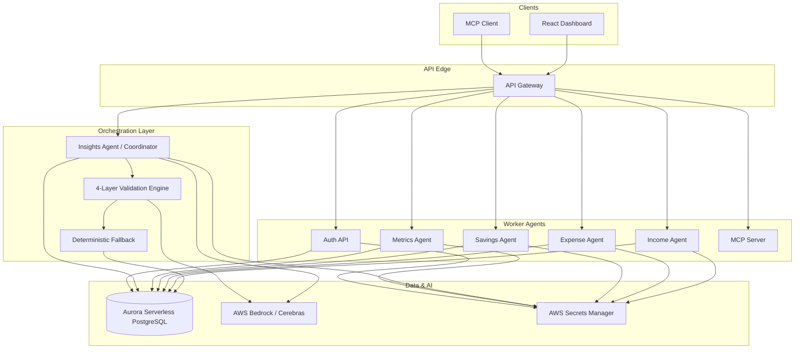

# 🏦 Personal Financial Intelligence Platform (PFIP)

> **Deterministic Multi-Agent System for Verifiable Financial Insights**

[](https://python.org)
[](https://aws.amazon.com/lambda/)
[](https://fastapi.tiangolo.com)
[](https://reactjs.org)
[](https://modelcontextprotocol.io)
[](https://pytest.org)

**PFIP** is a production-oriented serverless multi-agent platform designed to reduce hallucination risk in financial AI. It combines a coordinator-worker architecture with a deterministic validation loop so natural-language insights stay grounded in verifiable financial data.

---

## 🎯 Why PFIP?

- **No blind LLM output**: insights are validated against deterministic financial context before being returned.
- **Guardrailed reliability**: failed validation triggers bounded retry and deterministic fallback behavior.
- **MCP-native interface**: financial tools are exposed through Model Context Protocol for conversational workflows.
- **Serverless economics**: event-driven AWS architecture helps minimize idle operational overhead.

---

## 🏗️ Engineering Design Decisions

### 🛡️ Deterministic Validation Over Blind Generation
PFIP uses a **4-layer validation engine** (grounding, coverage, relevance, consistency) with bounded retry and deterministic fallback.
Numeric grounding is enforced against context data within ±1.5%.
[Deep dive →](docs/validation-engine.md)

### ⚡ Serverless-First for Cost and Scale
- **AWS Lambda + FastAPI** keeps services event-driven and operationally lightweight.
- **Aurora Serverless v2 (PostgreSQL)** preserves relational integrity while scaling with demand.
- This design minimizes idle infrastructure cost and simplifies production maintenance.

### 📈 Observability by Default
- The orchestration layer tracks execution state via `OrchestrationState` (decision path, retries, latency, and LLM call count).
- Structured logs and trace metadata support debugging, evaluation, and reliability tuning.

---

## ✨ Key Features

### 🤖 AI-Powered Intelligence
- **Smart Expense Categorization** using AWS Bedrock (Claude/Nova)
- **Natural Language Insights** - Query your finances in plain English
- **LLM-as-Judge System** with Chain-of-Thought retry and SQL fallback
- **Accuracy Tracking** for continuous improvement

### 🏗️ Modern Architecture
- **Serverless-First** on AWS Lambda with FastAPI
- **Aurora Serverless v2** PostgreSQL database
- **Microservices Design** with specialized agents
- **Model Context Protocol** for Claude Desktop integration

### 📊 Comprehensive Financial Management
- **Income Tracking** with recurring income support
- **Expense Management** with automatic categorization
- **Savings Goals** with progress tracking and milestones
- **Real-time Metrics** and visual analytics

### 🔒 Enterprise-Grade Security
- **AWS Cognito** authentication (production)
- **JWT-based auth** for local development
- **Secrets Manager** integration
- **IAM role-based access control**

---

## 🏛️ Architecture Overview



### 📁 Project Structure

```
pfip-mvp/
├── 📂 src/
│   ├── 📂 shared/              # Core utilities (auth, db, llm, logging)
│   ├── 📂 income_agent/        # Income tracking microservice
│   ├── 📂 expense_agent/       # Expense management + AI categorizer
│   ├── 📂 savings_agent/       # Savings goals + progress calculator
│   ├── 📂 insights_agent/      # NL insights + LLM judge system
│   ├── 📂 metrics_agent/        # Real-time financial metrics
│   ├── 📂 mcp_server/          # Model Context Protocol server
│   └── 📂 auth_api/            # Authentication service
├── 📂 infra/                   # Terraform infrastructure
├── 📂 frontend/                # React dashboard
├── 📂 tests/                   # Comprehensive test suite
├── 📂 scripts/                 # Utilities and migration tools
└── 📂 .github/workflows/       # CI/CD pipeline
```

---

## 🚀 Quick Start

### 📋 Prerequisites
- Python 3.11+
- Node.js 18+
- Docker & Docker Compose
- AWS CLI (optional, for deployment)

### 🏠 Local Development (Isolated Environment)

**1. Clone Repository**
```bash
git clone https://github.com/habeneyasu/personal-finance-agent.git
cd personal-finance-agent
```

**2. Create and Activate Virtual Environment**
```bash
python3 -m venv .venv
source .venv/bin/activate
pip install -e ".[dev]"
```

**3. Configure Local Environment**
```bash
cp .env.example .env.local
# Edit .env.local with your local values (DB_PASSWORD, JWT_SECRET, optional API keys)
```

**4. Start Local Database**
```bash
docker-compose up -d
```

**5. Run Database Setup**
```bash
python3 scripts/migrate.py --env local
python3 scripts/seed_demo.py --env local --reset
```

**6. Start Backend API**
```bash
uvicorn scripts.run_api_local:app --port 8000 --reload
```

**7. Start Frontend**
```bash
cd frontend && npm install && npm run dev
```

**8. Access the Application**
- 🌐 Frontend: http://localhost:5173
- 🔐 Login: `demo@pfip.dev` / `Demo1234!`
- 📚 API Docs: http://localhost:8000/docs

**9. Optional: MCP Inspector**
```bash
npx @modelcontextprotocol/inspector python3 scripts/run_mcp_local.py
```

---

## 🧪 Testing

### Run All Tests
```bash
pip install -e ".[dev]"
ENVIRONMENT=local pytest tests/unit/ --cov=src --cov-fail-under=80 -q
```

### Test Categories
- Unit tests for agents, auth, MCP, and shared modules
- Coverage enforcement in CI (`--cov-fail-under=80`)
- Deterministic validation-path tests for insights reliability

---

## 🌩️ AWS Deployment

### Infrastructure as Code
```bash
cd infra
terraform init
terraform apply \
  -var="aurora_master_password=YourSecurePassword" \
  -var="subnet_ids=[\"subnet-xxx\",\"subnet-yyy\"]" \
  -var="vpc_id=vpc-xxx"
```

### CI/CD Integration
The platform includes a complete GitHub Actions pipeline for:
- **Automated Testing** on every push
- **Infrastructure Deployment** on merge
- **Security Scanning** and compliance checks
- **Performance Monitoring** setup

### Required Secrets
- `AWS_ACCESS_KEY_ID`, `AWS_SECRET_ACCESS_KEY`
- `AURORA_MASTER_PASSWORD`, `TF_SUBNET_IDS`, `TF_VPC_ID`
- `JWT_SECRET`, `PFIP_API_KEY`
- Optional: `CEREBRAS_API_KEY` (for local/demo LLM path)

---

## 📚 API Documentation

### Core Endpoints

| Endpoint | Method | Description |
|----------|--------|-------------|
| `/v1/income` | GET/POST | Income tracking and management |
| `/v1/expenses` | GET/POST | Expense tracking with AI categorization |
| `/v1/goals` | GET/POST | Savings goals and progress |
| `/v1/insights/query` | POST | Natural language financial insights |
| `/v1/metrics` | GET | Real-time financial metrics |
| `/auth/*` | POST | Authentication (local dev only) |

### MCP Integration
The platform exposes **7 tools** and **3 resources** through Model Context Protocol.

**Tools**
- `create_income_entry`, `list_income_entries`
- `create_expense_entry`, `list_expense_entries`
- `create_savings_goal`, `list_savings_goals`
- `query_insights`

**Resources**
- `income://entries`
- `expenses://entries`
- `goals://active`

---

## 🎯 Use Cases

### 💼 Personal Finance Management
- Track monthly income and expenses
- Set and monitor savings goals
- Get AI-powered spending insights
- Export financial reports

### 🤖 AI Assistant Integration
- Connect with Claude Desktop via MCP
- Query finances in natural language
- Automate categorization workflows
- Generate personalized insights

### 📊 Financial Analytics
- Real-time spending patterns
- Goal progress visualization
- Income vs expense analysis
- Predictive savings projections

---

## 🔧 Development

### Code Quality
- **Type Hints** throughout the codebase
- **Pydantic Models** for data validation
- **Structured Logging** with correlation IDs
- **Error Handling** with custom exceptions

### Performance
- **Serverless architecture** for on-demand scaling
- **Deterministic validation and fallback** for reliable insights
- **Bounded retries** to control latency and cost

### Security
- **Input Validation** and sanitization
- **SQL Injection Prevention** with parameterized queries
- **Authentication & authorization** checks
- **Secrets Management** best practices

---

## 📈 Roadmap

### 🚧 In Progress
- [ ] Mobile app development
- [ ] Advanced AI insights (spending predictions)
- [ ] Multi-currency support
- [ ] Investment tracking integration

### 🎯 Coming Soon
- [ ] Budget planning tools
- [ ] Bill payment reminders
- [ ] Tax optimization insights
- [ ] Financial health scoring

### 💡 Future Enhancements
- [ ] Plaid integration for bank syncing
- [ ] Machine learning for fraud detection
- [ ] Collaborative family budgeting
- [ ] Advanced reporting and analytics

---

## 🤝 Contributing

We welcome contributions! Please see our [Contributing Guide](CONTRIBUTING.md) for details.

### Development Workflow
1. Fork the repository
2. Create a feature branch
3. Write tests for your changes
4. Ensure all tests pass
5. Submit a pull request

---

## 📬 Support

For issues or questions, open a GitHub Issue.
For security concerns, email `habeneyasu@gmail.com`.

---

## 📄 License

Distributed under the MIT License. See [LICENSE](LICENSE) for more information.

---
## 🙏 Acknowledgments

- **Andela** - for the AI Engineering Bootcamp and sponsorship of this capstone.
- **AWS** - for generous free-tier resources.
- **MCP** - for standardizing AI-agent tooling.
---

<div align="center">

If this project helps you, please ★ star the repository.

Maintained by Haben Eyasu as part of the Andela AI Engineering Bootcamp.

</div>
